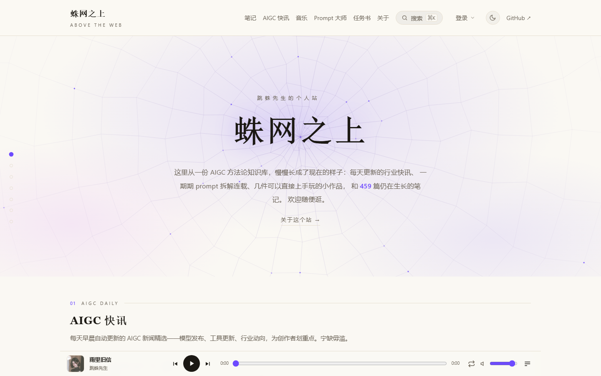
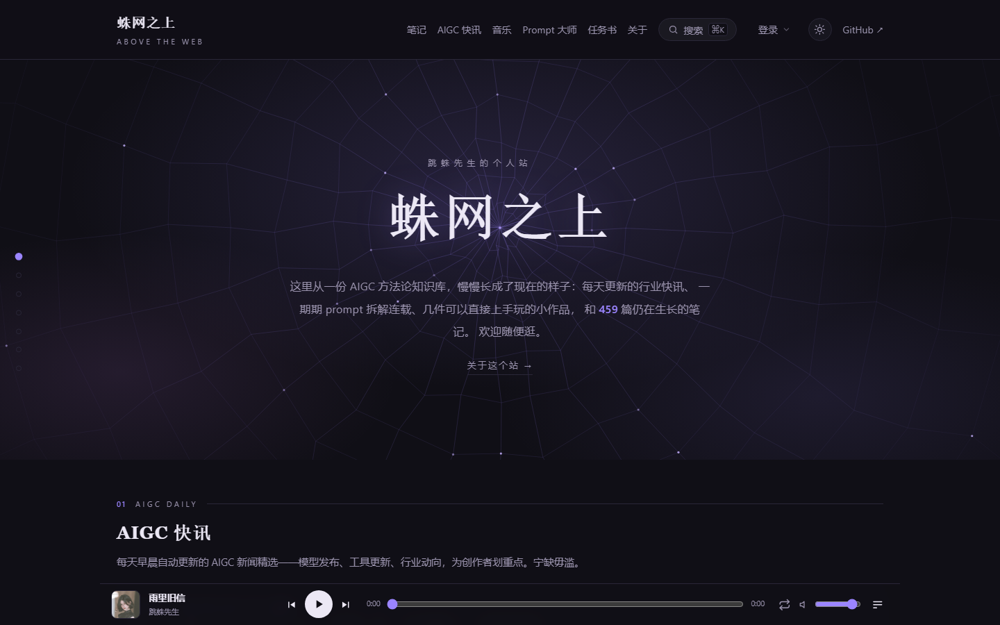
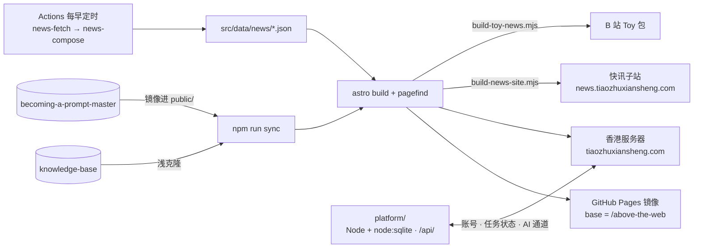

<div align="center">


# 蛛网之上 · Above the Web

**跳蛛先生的杂志风个人站** — 笔记 · AIGC 快讯 · Prompt 拆解连载 · 可玩 · 音乐 · 任务书

[](https://github.com/Mr-Salticidae/above-the-web/actions/workflows/deploy.yml)
[](https://github.com/Mr-Salticidae/above-the-web/actions/workflows/aigc-daily-news.yml)


[](https://github.com/Mr-Salticidae/knowledge-base/blob/main/LICENSE.md)

[主站](https://tiaozhuxiansheng.com/) · [GitHub Pages 镜像](https://mr-salticidae.github.io/above-the-web/) · [快讯子站](https://news.tiaozhuxiansheng.com/) · [关于本站](https://tiaozhuxiansheng.com/about/)

</div>

<p align="center">
  
  
</p>

## 这是什么

把一份 Obsidian 创作知识库搬上网，再让它长成一本每天都在更新的杂志。站上所有内容都围绕一件事：
用 AI 做图像、视频、音乐时，哪些经验值得留下、哪些工具值得关注、哪些东西可以直接拿去玩。

三条硬约束贯穿始终：

- **读站不需要账号**，页面里没有统计脚本和广告。只有认领任务书才要登录，因为那头连着报酬。
- **静态优先**。能在构建期算好的都在构建期算好（笔记、快讯、播放列表、关于页的计数）；只有账号与任务状态走服务端。
- **国内直连**。香港服务器是主入口，桌面小工具的安装包也从这里直发，不走网盘。

## 站上有什么

| 版块 | 路径 | 内容从哪来 | 一句话 |
| --- | --- | --- | --- |
| 笔记 | `/notes/` | 构建时浅克隆 [knowledge-base](https://github.com/Mr-Salticidae/knowledge-base)，按 `src/lib/kb.mjs` 的 `SELECTED` 白名单发布 7 个栏目 | 方法论、prompt 模板、sref 与参数档案；Obsidian `[[双链]]` 渲染成站内链接，带反向链接 |
| AIGC 快讯 | `/news/` | `src/data/news/YYYY-MM-DD.json`，GitHub Actions 每早自动生成 | 一天一期，每条附来源直达；另打一份发给学员的子站 |
| 成为 Prompt 大师 | `/prompt-master/` | 构建时镜像 [becoming-a-prompt-master](https://github.com/Mr-Salticidae/becoming-a-prompt-master) 进 `public/` | 面向小白的 prompt 拆解连载，每期一个 battle 主题 |
| 可玩 | 首页 `#plays` | `src/data/games.js` + `public/<作品>/` 落地页 | vibe coding 小作品：在线可玩，或免费下载的 Windows 小工具 |
| 音乐 | `/music/` | `src/data/music/manifest.json`；音频存服务器 `/music/` | AI 协作创作的歌，全站底部有播放器 |
| 任务书 | `/tasks/` | `src/data/tasks/*.md`，或管理台直接新建；状态归数据库 | 对外合作任务，认领需登录 |
| 关于 | `/about/` | 页面本身；六个版块的计数构建期现算 | 站长、规矩、时间线、制作说明、许可与联系方式 |

站内还有 Pagefind 全文搜索、知识库 AI 查询（查笔记小助手「小织」）、账号中心与管理台。完整路由表见 [docs/PROJECT_MAP.md](docs/PROJECT_MAP.md)。

## 架构一览



- **静态主站**：Astro 5 文件系统路由 + Content Collections（笔记、任务书）。`remark-wikilink` 在构建期把 `[[双链]]` 解析成站内链接，`remark-safe-images` 先把破损图片中性化。
- **搜索**：Pagefind 在构建后为 `dist/` 生成静态索引，零后端。
- **知识库 AI 查询**：Pagefind 先找相关笔记，登录用户再通过站内 AI 通道获得带原文引用的多轮回答。
- **账号与任务流转**：`platform/`，零第三方依赖的 Node 服务，跑在香港服务器，nginx 反代到 `tiaozhuxiansheng.com/api/`。
- **三种构建变体**：主站（默认）、`TOY_NEWS=1`（B 站 Toy 包）、`NEWS_SITE=1`（快讯子站）。后两种只带快讯，导航改指线上主站的绝对地址。

## 快速开始

需要 Node 22（`.nvmrc` 已固定）、npm、git，以及能访问 GitHub（内容同步要克隆两个公开仓库）。

```bash
npm ci
```

```bash
npm run dev
```

| 命令 | 作用 |
| --- | --- |
| `npm run dev` | 先 `sync` 再起 dev server，默认 `http://localhost:4321/above-the-web/` |
| `npm run dev:nosync` | 跳过内容同步，离线也能改样式 |
| `npm run sync` | 克隆或更新 `knowledge-base` 到 `kb-content/`、清洗 frontmatter BOM、镜像 Prompt 大师到 `public/prompt-master/`（两处都已 gitignore） |
| `npm run build` | sync → stamp（内嵌资源按内容哈希加 `?v=`） → `astro build` → Pagefind 索引 |
| `npm run preview` | 本地预览 `dist/` |
| `npm test` | `node --test` 纯逻辑单元测试；CI 里挂了就不出包 |

账号、任务认领、管理台这类动态功能要另起 API：

```bash
cd platform/server && npm run dev
```

默认监听 `127.0.0.1:3200`，首次启动会建管理员账号。本地运行与部署的完整说明在 [docs/LOCAL_RUN_AND_DEPLOYMENT.md](docs/LOCAL_RUN_AND_DEPLOYMENT.md)。

构建期环境变量：

| 变量 | 默认 | 说明 |
| --- | --- | --- |
| `BASE_PATH` | `/above-the-web` | 站点子路径；香港服务器构建设为 `/` |
| `SITE_URL` | `https://mr-salticidae.github.io` | 站点根域，生成 canonical 等绝对地址 |
| `PUBLIC_ATW_API` | 空 | 账号 API 地址；不设时前端回落到主域 `/api/` |
| `TOY_NEWS` / `NEWS_SITE` | 空 | 置 `1` 进入对应的只带快讯的构建变体（由脚本设置，一般不用手动传） |

## 仓库结构

```text
.
├─ src/
│  ├─ pages/            路由：首页、notes、news、music、tasks、account、admin、about
│  ├─ layouts/          BaseLayout（顶栏 / 页脚 / 昼夜主题 / 三种构建变体）
│  ├─ components/       搜索、账号菜单、播放器、快讯期刊、知识库对话、蛛网背景
│  ├─ lib/              构建期数据层：kb / notes / news / prompt-master / remark 插件
│  ├─ scripts/          浏览器端脚本：账号、任务注水、播放器、滚动渐现、AI 辅助
│  ├─ data/             news/ 期刊 JSON · tasks/ 任务书 md · games.js · music/manifest.json
│  └─ styles/global.css 设计 token 与全局样式
├─ public/              静态资源与可玩作品落地页（fraud-desk、desk-pond、livelink …）
├─ scripts/             sync-content · stamp-assets · news-fetch · news-compose · build-news-site · build-toy-news · upload-music
├─ platform/            账号与任务流转服务（server/）与服务器部署脚本（deploy/）
├─ workers/ functions/ api-proxy/   Maieutic 对话工具的 API 代理（Cloudflare Worker / Pages Functions）
├─ docs/                项目文档：大写下划线命名，首行标最后更新日期
├─ test/                node --test 单元测试
└─ .github/workflows/   deploy · deploy-platform · aigc-daily-news · toy-news-update
```

## 内容与自动化

### 笔记：自动同步自知识库

`scripts/sync-content.mjs` 浅克隆 `knowledge-base`，只发布 `SELECTED` 白名单里的栏目：方法论与洞察 / prompt模板库 / sref档案 / 参数行为档案 / 视觉系统 / skill存档 / 平台工程。

站点在以下时机重建部署：本仓库 push、每 6 小时定时、手动 `workflow_dispatch`、`knowledge-base` 发来的 `repository_dispatch`（type `kb-updated`）。

要让 knowledge-base 一更新就秒级同步（可选，一次性配置）：

1. 建一个有 `repo` 权限的 PAT，加到 `knowledge-base` 仓库 secret `DISPATCH_TOKEN`。
2. 在 `knowledge-base` 加 workflow，push 时调用本仓库的 `repository_dispatch`（event_type `kb-updated`）。

未配置时，定时 + push 已能保证同步，只是不即时。

### AIGC 快讯：每天早晨云端自动出刊

- `.github/workflows/aigc-daily-news.yml` 一天四枪错峰 cron 互为重试（GitHub schedule 在整点高峰会延迟甚至丢弃）；当日期刊已存在则几秒空跑，幂等。
- `scripts/news-fetch.mjs` 纯 Node 抓多个 RSS 源产出候选（零 API 成本）→ `scripts/news-compose.mjs` 一次结构化输出调用完成选稿与中文摘要。URL 由脚本从候选表回填，模型只输出候选 id，无从编造链接。
- 模型走 OpenAI 兼容协议，当前是 DashScope 的 `qwen3.8-max`；换供应商只改 `NEWS_API_BASE` / `NEWS_MODEL`，前提是对方支持 `response_format.json_schema`。
- 单次成本从早期 agentic 方案的约 7 美元降到约 0.1 美元。
- 想先看效果再决定发不发：手动触发 workflow 并勾选 `dry_run`。

### 快讯的两份副本

- **子站** `news.tiaozhuxiansheng.com`：`scripts/build-news-site.mjs` 用哨兵 base 另打一份根路径产物 `dist-news/`，`NEWS_SITE=1` 下署名换成「GenJi是真想教会你」、整站 `noindex`、不渲染任何通往个人站的导航。脚本自带守卫：产物里一旦出现自家链接就构建失败。主站 `/news/` 是原件，canonical 自指。
- **B 站 Toy**：`scripts/build-toy-news.mjs` 打成相对路径的独立包，`toy-news-update.yml` 每天 12:30 在当天有新期刊时重传送审。

### 可玩与音乐

- 新增一件可玩作品 = 在 `src/data/games.js` 开头加一条，落地页放 `public/<slug>/`。桌面应用的安装包不进 git、不进 Pages：`deploy.yml` 从各自仓库的最新 Release 抓取，随 `dist/` 一起 rsync 到香港服务器直连下载。
- 音乐：曲目元数据在 `src/data/music/manifest.json`，音频用 `scripts/upload-music.mjs` 传到服务器 `/music/`，构建期导出 `/music/playlist.json` 给全站播放器。

## 部署

同一次 `deploy.yml` 产出三个目标：

| 目标 | 地址 | 构建参数 | 落点 |
| --- | --- | --- | --- |
| GitHub Pages 镜像 | `mr-salticidae.github.io/above-the-web/` | 默认 | `actions/deploy-pages` |
| 香港服务器（国内主入口） | `tiaozhuxiansheng.com` | `BASE_PATH=/` `SITE_URL=https://tiaozhuxiansheng.com` | rsync 到 `/var/www/tiaozhuxiansheng/` |
| 快讯子站 | `news.tiaozhuxiansheng.com` | `build-news-site.mjs` | rsync 到 `/var/www/atw-news/` |

香港 job 还会顺手镜像 `mirror-life-rehearsal-preview` 到 `/mlr/`、`typhoon-eye` 到 `/typhoon-eye/`，并抓取 desk-pond 与 livelink 的最新安装包。

账号服务单独走 `deploy-platform.yml`：`platform/**` 有改动就先跑流转回归测试，过了再 rsync 到 `/opt/atw-platform/` 并重启 systemd 服务。

仓库需要的 secrets：

| Secret | 用途 |
| --- | --- |
| `HK_SSH_KEY` | 香港服务器的部署私钥（主站、子站、账号服务共用） |
| `DASHSCOPE_API_KEY` | 每日快讯的选稿与摘要模型 |
| `TOY_SESSION` | B 站 Toy CLI 的登录态（`~/.toy/session.json` 原文） |

## 账号与任务书

读站永远不需要账号。任务书可以写在 `src/data/tasks/*.md`（push 即发布），也可以在管理台「新建任务书」里直接发，后者正文存数据库、页面走 `/tasks/detail/?slug=`，随时能导出成 md 提进 git。状态一律归数据库：认领、定人、交付、打款在站内点，实时生效，不用重新构建。

- 登录 `/account/login/`、注册 `/account/register/`、个人中心 `/account/`。本机可同时留几个账号，切换不用重输密码；个人中心能看登录设备、单独踢掉某一处。
- 忘记密码走 `/account/forgot/`：一次性链接 60 分钟有效、用过即焚。发信通道未配时自动退回「管理台生成链接、站长人工发」。
- 发任务、接任务各有一个 AI 帮手：说一句大白话，它把表单填好，人再过一眼。
- API 只有一套（`tiaozhuxiansheng.com/api/`）。Pages 镜像跨域也能用，只是两个域的登录态各自独立。

服务代码、状态机、两种任务书的分工、部署与运维都在 [platform/README.md](platform/README.md)。

## 文档

| 文档 | 内容 |
| --- | --- |
| [docs/PROJECT_MAP.md](docs/PROJECT_MAP.md) | 全站路由表与技术框架 |
| [docs/LOCAL_RUN_AND_DEPLOYMENT.md](docs/LOCAL_RUN_AND_DEPLOYMENT.md) | 本地运行、构建与生产部署 |
| [docs/KNOWLEDGE_BASE_AI_QUERY.md](docs/KNOWLEDGE_BASE_AI_QUERY.md) | 知识库 AI 查询的工作机制 |
| [docs/KB_ASSISTANT_PERSONA.md](docs/KB_ASSISTANT_PERSONA.md) | 查笔记小助手「小织」的角色卡 |
| [docs/TASK_AI_ASSIST.md](docs/TASK_AI_ASSIST.md) | 任务书 AI 辅助填写 |
| [docs/MUSIC_PLAYER.md](docs/MUSIC_PLAYER.md) | 音乐板块与全站播放器 |
| [platform/README.md](platform/README.md) | 账号与任务流转服务 |
| [AGENTS.md](AGENTS.md) | 文档规范（放 `docs/`、大写下划线命名、首行标日期） |

建站过程中的踩坑与复盘，发布在站内笔记的[「平台工程」栏目](https://tiaozhuxiansheng.com/notes/?cat=%E5%B9%B3%E5%8F%B0%E5%B7%A5%E7%A8%8B)。

## 致谢

- **X-nian** 贡献了「TK 中英文字幕转换器」。
- **GenJi是真想教会你** 的学员是快讯子站的第一批读者。
- 快讯每条都附来源直达，内容版权归各原始媒体。
- [Astro](https://astro.build/)、[Pagefind](https://pagefind.app/) 让一个人也能把静态站做得像回事。

## 许可

- **笔记内容**遵循源仓库的 [CC BY-NC 4.0](https://github.com/Mr-Salticidae/knowledge-base/blob/main/LICENSE.md)：署名、非商业，转载改写请保留作者与仓库链接。
- **快讯摘要**为站内编辑，转载注明「蛛网之上」即可；原文版权归各来源。
- **站点源码**公开在本仓库，尚未附独立的代码许可证；要整站复用请先开 issue 打个招呼。
