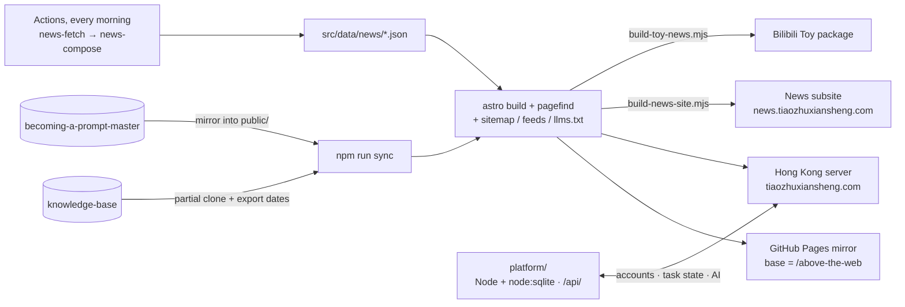

最后更新：2026-09-25

<div align="center">


# 蛛网之上 · Above the Web

**A magazine-style personal site by 跳蛛先生 (Mr. Jumping Spider)**: notes, daily AIGC news, a prompt-breakdown series, playable toys, music and paid commissions.

[简体中文](../README.md) · English · [日本語](README_JA.md)

[](https://github.com/Mr-Salticidae/above-the-web/actions/workflows/deploy.yml)
[](https://github.com/Mr-Salticidae/above-the-web/actions/workflows/aigc-daily-news.yml)


[](../LICENSE)
[](https://github.com/Mr-Salticidae/knowledge-base/blob/main/LICENSE.md)

[Main site](https://tiaozhuxiansheng.com/) · [GitHub Pages mirror](https://mr-salticidae.github.io/above-the-web/) · [News subsite](https://news.tiaozhuxiansheng.com/) · [About](https://tiaozhuxiansheng.com/about/)

</div>

<p align="center">
  
  
</p>

> The site itself is in Chinese, and so are the other documents under `docs/`. This page is a translation of the [Chinese README](../README.md). If the two disagree, the Chinese version is authoritative.

## What this is

It started as an Obsidian knowledge base about creative work with AI, put on the web, and grew into a magazine that updates every day. Everything on the site is about one question: when you make images, video and music with AI, which lessons are worth keeping, which tools are worth watching, and what can you just pick up and play with?

Three rules hold throughout:

- **Reading never requires an account.** There are no analytics scripts or ads. You only log in to claim a commission, because that involves payment.
- **Static first.** Anything that can be computed at build time is computed at build time: notes, news, the playlist, the counters on the About page. Only accounts and task state live on a server.
- **Directly reachable from mainland China.** A Hong Kong server is the main entry point. Installers for the desktop toys are served from there too, not from a cloud drive.

## What's on the site

| Section | Path | Where the content comes from | In one line |
| --- | --- | --- | --- |
| Notes | `/notes/` | Partial clone of [knowledge-base](https://github.com/Mr-Salticidae/knowledge-base) at build time. The `SELECTED` allow-list in `src/lib/kb.mjs` publishes 7 categories | Methods, prompt templates, sref and parameter archives. Obsidian `[[wikilinks]]` become site links, with backlinks |
| AIGC News | `/news/` | `src/data/news/YYYY-MM-DD.json`, generated every morning by GitHub Actions | One issue a day, every item links to its source. A second copy is built as a subsite for students |
| Becoming a Prompt Master | `/prompt-master/` | [becoming-a-prompt-master](https://github.com/Mr-Salticidae/becoming-a-prompt-master) mirrored into `public/` at build time | A beginner-friendly series that breaks down prompts, one "battle" theme per episode |
| Plays | Home page `#plays` | `src/data/games.js` plus a landing page in `public/<slug>/` | Small vibe-coded works: play online, or download a free Windows tool |
| Music | `/music/` | `src/data/music/manifest.json`. Audio lives on the server under `/music/` | Songs made with AI. A player sits at the bottom of every page |
| Commissions | `/tasks/` | `src/data/tasks/*.md`, or created in the admin console. State lives in the database | Paid collaboration tasks. Claiming one requires an account |
| About | `/about/` | The page itself. Counts for the six sections are computed at build time | The owner, house rules, timeline, how it's built, licenses and contact |

The site also has Pagefind full-text search, an AI assistant for the notes ("小织", Xiaozhi), an account center and an admin console. Subscribe via [RSS](https://tiaozhuxiansheng.com/rss.xml) or [JSON Feed](https://tiaozhuxiansheng.com/feed.json), or subscribe to notes or news separately. The full route table is in [PROJECT_MAP.md](PROJECT_MAP.md) (Chinese).

## Architecture



- **Static site**: Astro 5 file-based routing with Content Collections for notes and commissions. At build time `remark-wikilink` resolves `[[wikilinks]]` into site links, and `remark-safe-images` neutralizes broken images first.
- **Content timeline**: during sync, publish and update dates for every note are exported from the knowledge base's git history. A date at the start of the file name wins. Article pages, feeds and the sitemap all use the same dates.
- **Distribution**: every page's canonical URL points at the main site, with Open Graph and JSON-LD structured data. The build also generates sitemap.xml, three RSS feeds plus a JSON Feed, robots.txt, llms.txt and a PWA manifest, with no extra dependencies.
- **Reading and navigation**: a sticky table of contents with scroll-spy, heading anchors, Shiki code blocks with light and dark themes, reading time and related notes. Page changes use cross-document View Transitions, and Speculation Rules prerender on hover.
- **Search**: Pagefind builds a static index over `dist/` after the build, so there is no search backend. Site chrome such as the header, footer and player is excluded from the index.
- **AI search over the notes**: Pagefind finds relevant notes first. Logged-in users then get multi-turn answers that quote the original notes, through the site's AI channel.
- **Accounts and task flow**: `platform/` is a Node service with no third-party dependencies. It runs on the Hong Kong server behind nginx at `tiaozhuxiansheng.com/api/`.
- **Three build variants**: the main site (default), `TOY_NEWS=1` (the Bilibili Toy package) and `NEWS_SITE=1` (the news subsite). The last two contain only the news, and their navigation points at absolute URLs on the main site.

## Quick start

You need Node 22 (pinned in `.nvmrc`), npm, git, and access to GitHub, because content sync clones two public repositories.

```bash
npm ci
```

```bash
npm run dev
```

| Command | What it does |
| --- | --- |
| `npm run dev` | Runs `sync`, then starts the dev server. The default URL is `http://localhost:4321/above-the-web/` |
| `npm run dev:nosync` | Skips content sync, so you can work on styles offline |
| `npm run sync` | Partially clones or updates `knowledge-base` into `kb-content/`. Exports note dates from git history to `.cache/kb-dates.json`, strips BOMs from frontmatter, and mirrors Prompt Master into `public/prompt-master/`. All of these are gitignored |
| `npm run build` | sync → stamp (adds `?v=` content hashes to embedded assets) → `astro build` (including sitemap, feeds and llms.txt) → Pagefind index |
| `npm run preview` | Serves `dist/` locally |
| `npm test` | Pure-logic unit tests with `node --test`. If they fail in CI, nothing ships |
| `cd platform/server && npm test` | Flow regression tests for the account and task service: sign-up and login, claim and delivery, password reset, rate limits, AI quotas. If they fail, nothing deploys |

Accounts, claiming commissions and the admin console need the API running separately:

```bash
cd platform/server && npm run dev
```

It listens on `127.0.0.1:3200` by default and creates an admin account on first start. Full instructions for local runs and deployment are in [LOCAL_RUN_AND_DEPLOYMENT.md](LOCAL_RUN_AND_DEPLOYMENT.md) (Chinese).

Build-time environment variables:

| Variable | Default | Description |
| --- | --- | --- |
| `BASE_PATH` | `/above-the-web` | Site sub-path. The Hong Kong build sets it to `/` |
| `SITE_URL` | `https://mr-salticidae.github.io` | Site origin, used for canonical and other absolute URLs |
| `PUBLIC_ATW_API` | empty | Account API URL. When unset, the front end falls back to `/api/` on the main domain |
| `TOY_NEWS` / `NEWS_SITE` | empty | Set to `1` for the corresponding news-only build variant. The scripts set these, so you rarely pass them by hand |

## Repository layout

```text
.
├─ src/
│  ├─ pages/            Routes: home, notes, news, music, tasks, account, admin, about
│  ├─ layouts/          BaseLayout (header / footer / light-dark theme / three build variants)
│  ├─ components/       SEO head, search, account menu, player, news issue, notes chat, web background
│  ├─ lib/              Build-time data layer: kb / notes / news / prompt-master / remark plugins / dates / feeds / sitemap / structured data
│  ├─ integrations/     Local Astro integration (writes sitemap.xml after the build)
│  ├─ scripts/          Browser scripts: accounts, task hydration, player, scroll reveal, AI assist, article enhancements
│  ├─ data/             news/ issue JSON · tasks/ commission md · games.js · music/manifest.json
│  └─ styles/global.css Design tokens and global styles
├─ public/              Static assets and landing pages for playable works (fraud-desk, desk-pond, livelink …)
├─ scripts/             sync-content · stamp-assets · news-fetch · news-compose · build-news-site · build-toy-news
│                       collect-music · upload-music · music-manifest · make-brand-assets
├─ platform/            Account and task service (server/) and server deployment scripts (deploy/)
├─ docs/                Project docs: UPPER_SNAKE_CASE names, first line is the last-updated date (includes this translation)
├─ test/                node --test unit tests
├─ .github/workflows/   deploy · deploy-platform · aigc-daily-news · toy-news-update · music-inbox · nginx-site
└─ LICENSE              MIT license for the site's source code
```

## Content and automation

### Notes: synced from the knowledge base

`scripts/sync-content.mjs` makes a blobless partial clone of `knowledge-base`: full commit history, files fetched on demand, about the size of a shallow clone. It publishes only the categories in the `SELECTED` allow-list: 方法论与洞察 (methods and insights), prompt模板库 (prompt templates), sref档案 (sref archive), 参数行为档案 (parameter behavior archive), 视觉系统 (visual systems), skill存档 (skill archive) and 平台工程 (platform engineering). Sync also exports each note's publish and update dates from git history. A file name starting with `YYYY-MM-DD` takes precedence.

The site is rebuilt and deployed on a push to this repo, every 6 hours, on a manual `workflow_dispatch`, and on a `repository_dispatch` (type `kb-updated`) sent by `knowledge-base`.

Optional one-time setup, so that a knowledge-base update syncs within seconds:

1. Create a PAT with `repo` scope and add it to the `knowledge-base` repo as the secret `DISPATCH_TOKEN`.
2. Add a workflow to `knowledge-base` that, on push, calls this repo's `repository_dispatch` with event_type `kb-updated`.

Without it, the schedule and pushes still keep things in sync, just not instantly.

### AIGC News: published in the cloud every morning

- `.github/workflows/aigc-daily-news.yml` fires four staggered cron runs a day that act as retries for each other, because GitHub's scheduler delays or drops jobs at busy times on the hour. If today's issue already exists, a run exits in seconds, so it is idempotent.
- `scripts/news-fetch.mjs` fetches several RSS feeds in plain Node and produces candidates at zero API cost. Then `scripts/news-compose.mjs` makes one structured-output call that picks stories and writes Chinese summaries. The script fills in URLs from the candidate table and the model only outputs candidate ids, so it cannot invent links.
- The model is called through an OpenAI-compatible API, currently DashScope's `qwen3.8-max`. To switch providers, change only `NEWS_API_BASE` and `NEWS_MODEL`, as long as the provider supports `response_format.json_schema`.
- The cost per run fell from about US$7 with the early agentic approach to about US$0.10.
- To preview before publishing, trigger the workflow manually and tick `dry_run`.

### Two copies of the news

- **Subsite** `news.tiaozhuxiansheng.com`: `scripts/build-news-site.mjs` uses a sentinel base to build a separate root-path output, `dist-news/`. With `NEWS_SITE=1` the byline changes to 「GenJi是真想教会你」, the whole site is `noindex`, and there is no navigation back to the personal site. The script has a guard: the build fails if a link to the personal site appears in the output. The main site's `/news/` is the original, and its canonical points to itself.
- **Bilibili Toy**: `scripts/build-toy-news.mjs` builds a self-contained package with relative paths. `toy-news-update.yml` re-uploads it for review at 12:30 Beijing time on days with a new issue.

### Plays and music

- To add a playable work, add an entry at the top of `src/data/games.js` and put its landing page in `public/<slug>/`. Desktop installers stay out of git and out of Pages: `deploy.yml` fetches each app's latest Release and rsyncs it with `dist/` to the Hong Kong server for direct download.
- Music: track metadata lives in `src/data/music/manifest.json`, and the build exports `/music/playlist.json` for the site-wide player. Audio stays out of git and lives on the server under `/music/`. There are two ways to add songs:
  - From a computer that has the server key: `collect-music.mjs` gathers songs from scattered project folders into `music-library/`. `upload-music.mjs` uploads them and checks each file on the server. `music-manifest.mjs` then drafts the manifest.
  - From a computer without the key: upload the audio to the `music-inbox` Release and run `music-inbox.yml` by hand. CI transcodes, uploads, verifies and then cleans up the attachments. The repo is public, so the attachments can be downloaded by anyone until they are moved. Only put songs there that you have decided to publish.

## Deployment

One run of `deploy.yml` produces three targets:

| Target | URL | Build parameters | Destination |
| --- | --- | --- | --- |
| GitHub Pages mirror | `mr-salticidae.github.io/above-the-web/` | defaults | Force-pushed to the `gh-pages` branch (Pages publishes from the branch) |
| Hong Kong server (main entry for mainland China) | `tiaozhuxiansheng.com` | `BASE_PATH=/` `SITE_URL=https://tiaozhuxiansheng.com` | rsync to `/var/www/tiaozhuxiansheng/` |
| News subsite | `news.tiaozhuxiansheng.com` | `build-news-site.mjs` | rsync to `/var/www/atw-news/` |

The Hong Kong job also mirrors `mirror-life-rehearsal-preview` to `/mlr/` and `typhoon-eye` to `/typhoon-eye/`, and fetches the latest desk-pond and livelink installers.

The main site's nginx settings for the custom 404, the `.webmanifest` MIME type and `gzip_types` are in `platform/deploy/nginx-site-static.conf`. Apply them with the manual workflow `nginx-site.yml`: `inspect` is read-only; `apply` backs up, writes, runs `nginx -t` and reloads, and rolls back automatically if any step fails.

The account service deploys separately through `deploy-platform.yml`: when anything under `platform/**` changes, the flow regression tests run first. Only if they pass is the code rsynced to `/opt/atw-platform/` and the systemd service restarted.

Repository secrets:

| Secret | Purpose |
| --- | --- |
| `HK_HOST` | Address of the Hong Kong server (IP or domain). It is a secret rather than hard-coded, so it is masked in Actions logs. In a fork, point it at your own server |
| `HK_SSH_KEY` | Deploy key for the Hong Kong server, shared by the main site, the subsite and the account service |
| `DASHSCOPE_API_KEY` | The model that picks and summarizes the daily news |
| `TOY_SESSION` | Login session for the Bilibili Toy CLI (raw contents of `~/.toy/session.json`) |

## Accounts and commissions

Reading never needs an account. A commission can be written in `src/data/tasks/*.md` (published on push) or created with 「新建任务书」 (New commission) in the admin console. In the second case the body is stored in the database, the page is served at `/tasks/detail/?slug=`, and it can be exported to md and committed to git at any time. State always lives in the database: claiming, assigning, delivering and paying are all clicks on the site that take effect immediately, with no rebuild.

- Log in at `/account/login/`, register at `/account/register/`, and manage your account at `/account/`. A browser can keep several accounts and switch between them without re-entering passwords. The account page lists logged-in devices, and each one can be signed out individually.
- Forgotten passwords go through `/account/forgot/`: a one-time link that is valid for 60 minutes and is burned after use. If no mail provider is configured, it falls back to the admin generating a link and the owner sending it by hand.
- Both posting and taking a commission have an AI helper: describe what you want in plain words, it fills in the form, and a person checks it.
- The admin console's 「月度统计与对账」 (monthly statistics and reconciliation) page summarizes task counts, agreed amounts, payment progress and takers by delivery month or payment month, and can export a CSV statement.
- There is only one API (`tiaozhuxiansheng.com/api/`). It also works cross-origin from the Pages mirror, but the two domains keep separate login sessions.

The service code, state machine, the split between the two kinds of commissions, deployment and operations are all in [platform/README.md](../platform/README.md) (Chinese).

## Documentation

All documents below are in Chinese.

| Document | Contents |
| --- | --- |
| [PROJECT_MAP.md](PROJECT_MAP.md) | Full route table and technical framework |
| [SITE_ARCHITECTURE_UPGRADE.md](SITE_ARCHITECTURE_UPGRADE.md) | The September 2026 architecture upgrade: content timeline, distribution layer, article pages, prerendering and view transitions |
| [LOCAL_RUN_AND_DEPLOYMENT.md](LOCAL_RUN_AND_DEPLOYMENT.md) | Running locally, building, and production deployment |
| [KNOWLEDGE_BASE_AI_QUERY.md](KNOWLEDGE_BASE_AI_QUERY.md) | How AI search over the knowledge base works |
| [KB_ASSISTANT_PERSONA.md](KB_ASSISTANT_PERSONA.md) | Character sheet for the notes assistant 「小织」 |
| [TASK_AI_ASSIST.md](TASK_AI_ASSIST.md) | AI-assisted form filling for commissions |
| [MUSIC_PLAYER.md](MUSIC_PLAYER.md) | The music section and the site-wide player |
| [MUSIC_UPLOAD_HANDOFF.md](MUSIC_UPLOAD_HANDOFF.md) | Bulk-uploading songs without the server key (Release staging + the music-inbox workflow) |
| [TASK_MONTHLY_REPORT.md](TASK_MONTHLY_REPORT.md) | Monthly commission statistics and reconciliation rules |
| [SECURITY.md](SECURITY.md) | Security policy: how to report a vulnerability privately, scope, and repository conventions |
| [postmortem-2026-07-task-admin-home.md](postmortem-2026-07-task-admin-home.md) · [postmortem-2026-07-30-deliverable-link.md](postmortem-2026-07-30-deliverable-link.md) | Two postmortems on the commission system and admin console |
| [platform/README.md](../platform/README.md) | The account and task service |
| [AGENTS.md](../AGENTS.md) | Documentation rules (docs live in `docs/`, UPPER_SNAKE_CASE names, first line is the date) |

Lessons learned while building the site are published in the notes under the [「平台工程」 (platform engineering) category](https://tiaozhuxiansheng.com/notes/?cat=%E5%B9%B3%E5%8F%B0%E5%B7%A5%E7%A8%8B).

## Acknowledgements

- **X-nian** contributed the 「TK 中英文字幕转换器」 (TK Chinese-English subtitle converter).
- The students of **GenJi是真想教会你** were the first readers of the news subsite.
- Every news item links to its source. Copyright in the original reporting belongs to each outlet.
- [Astro](https://astro.build/) and [Pagefind](https://pagefind.app/) make it possible for one person to build a static site that holds up.

## Contributing and security

- For bugs or feature requests, open an issue. Before sending a PR, make sure `npm test` and the `platform/server` tests pass.
- Please don't report security problems in a public issue. Follow [SECURITY.md](SECURITY.md) to report them privately.
- To build your own site from this one: after forking, replace the site name, author and canonical domain in `src/lib/site.mjs`, the content source repositories in `scripts/sync-content.mjs`, and the category allow-list in `src/lib/kb.mjs`. Set `SITE_URL` and `BASE_PATH` for your deployment address at build time, and point the deploy secrets at your own server.

## License

- **Site source code** is open source under the [MIT](../LICENSE) license. You may freely use, modify and redistribute the code, build scripts, workflows and server, as long as you keep the copyright notice.
- **Notes** follow the source repository's [CC BY-NC 4.0](https://github.com/Mr-Salticidae/knowledge-base/blob/main/LICENSE.md) license: give credit, no commercial use, and keep the author and repository link when you repost or adapt them.
- **News summaries** are written by the site. To repost a summary, credit 「蛛网之上」 (Above the Web). Copyright in the original reporting belongs to each source.
- **Not covered by MIT**: the site name and logo, the 「小织」 character art, the music, and works by other people under `public/` (such as X-nian's subtitle converter and GenJi's logo). Replace them with your own assets when you fork.
