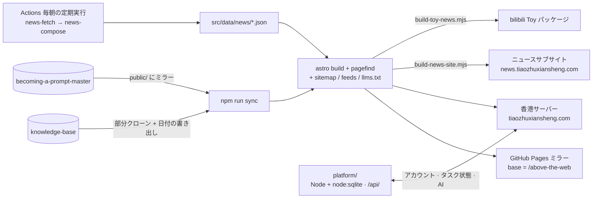

最后更新：2026-09-25

<div align="center">


# 蛛网之上 · Above the Web

**跳蛛先生（ハエトリグモ先生）の雑誌風個人サイト** — ノート · AIGC ニュース · プロンプト分解連載 · 遊べる作品 · 音楽 · 依頼書

[简体中文](../README.md) · [English](README_EN.md) · 日本語

[](https://github.com/Mr-Salticidae/above-the-web/actions/workflows/deploy.yml)
[](https://github.com/Mr-Salticidae/above-the-web/actions/workflows/aigc-daily-news.yml)


[](../LICENSE)
[](https://github.com/Mr-Salticidae/knowledge-base/blob/main/LICENSE.md)

[メインサイト](https://tiaozhuxiansheng.com/) · [GitHub Pages ミラー](https://mr-salticidae.github.io/above-the-web/) · [ニュースサブサイト](https://news.tiaozhuxiansheng.com/) · [このサイトについて](https://tiaozhuxiansheng.com/about/)

</div>

<p align="center">
  
  
</p>

> サイト本体と `docs/` 配下のほかのドキュメントは中国語です。このページは[中国語版 README](../README.md) の翻訳で、内容が食い違う場合は中国語版が正となります。

## これは何か

AI を使った創作についての Obsidian ナレッジベースを Web に載せ、毎日更新される雑誌に育てたものです。サイトの内容はすべて一つの問いをめぐっています。AI で画像・動画・音楽を作るとき、どの経験を残す価値があり、どのツールに注目すべきで、何ならそのまま遊べるのか。

一貫して守っている原則は三つです。

- **読むのにアカウントは不要。** アクセス解析スクリプトも広告もありません。ログインが必要なのは依頼書を引き受けるときだけです（報酬が絡むため）。
- **静的ファースト。** ビルド時に計算できるものはすべてビルド時に計算します（ノート、ニュース、プレイリスト、About ページの件数）。サーバーで扱うのはアカウントとタスクの状態だけです。
- **中国本土から直接つながる。** 香港のサーバーをメインの入口とし、デスクトップ作品のインストーラーもクラウドドライブではなくここから直接配布します。

## サイトの内容

| セクション | パス | コンテンツの出どころ | ひとこと |
| --- | --- | --- | --- |
| ノート | `/notes/` | ビルド時に [knowledge-base](https://github.com/Mr-Salticidae/knowledge-base) を部分クローン。`src/lib/kb.mjs` の `SELECTED` 許可リストで 7 カテゴリを公開 | 方法論、プロンプトテンプレート、sref とパラメーターのアーカイブ。Obsidian の `[[ウィキリンク]]` はサイト内リンクになり、バックリンク付き |
| AIGC ニュース | `/news/` | `src/data/news/YYYY-MM-DD.json`。毎朝 GitHub Actions が自動生成 | 1 日 1 号、各記事に出典リンク付き。受講生向けのサブサイト版も別途ビルド |
| プロンプトマスターへの道 | `/prompt-master/` | ビルド時に [becoming-a-prompt-master](https://github.com/Mr-Salticidae/becoming-a-prompt-master) を `public/` にミラー | 初心者向けのプロンプト分解連載。毎回ひとつの「バトル」テーマ |
| 遊べる作品 | トップページ `#plays` | `src/data/games.js` と `public/<作品>/` のランディングページ | バイブコーディングの小品。オンラインで遊べるもの、無料の Windows ツールなど |
| 音楽 | `/music/` | `src/data/music/manifest.json`。音声ファイルはサーバーの `/music/` に保存 | AI と一緒に作った曲。全ページ下部にプレーヤー |
| 依頼書 | `/tasks/` | `src/data/tasks/*.md`、または管理画面から新規作成。状態はデータベースで管理 | 外部向けの有償協力タスク。引き受けにはログインが必要 |
| About | `/about/` | ページ自体。6 セクションの件数はビルド時に算出 | 運営者、方針、年表、制作メモ、ライセンスと連絡先 |

ほかに Pagefind による全文検索、ノート向け AI アシスタント「小織」、アカウントセンターと管理画面があります。購読は [RSS](https://tiaozhuxiansheng.com/rss.xml) / [JSON Feed](https://tiaozhuxiansheng.com/feed.json) で、ノートやニュースだけを個別に購読することもできます。全ルート表は [PROJECT_MAP.md](PROJECT_MAP.md)（中国語）を参照してください。

## アーキテクチャ



- **静的サイト**：Astro 5 のファイルベースルーティングと Content Collections（ノート、依頼書）。ビルド時に `remark-wikilink` が `[[ウィキリンク]]` をサイト内リンクに解決し、その前に `remark-safe-images` が壊れた画像を無害化します。
- **コンテンツの時系列**：同期時にナレッジベースの git 履歴から各ノートの公開日・更新日を書き出します（ファイル名先頭の日付が優先）。記事ページ、フィード、サイトマップで共通に使います。
- **配信レイヤー**：全ページの canonical はメインサイトを指し、Open Graph と JSON-LD 構造化データを付けます。ビルド時に sitemap.xml、RSS 3 本と JSON Feed、robots.txt、llms.txt、PWA マニフェストを生成し、依存は増やしていません。
- **閲覧とナビゲーション**：記事ページは追従する目次とスクロール連動ハイライト、見出しアンカー、Shiki のライト／ダーク両対応コードブロック、読了時間、関連ノート付き。ページ遷移はドキュメント間の View Transitions、ホバー時は Speculation Rules でプリレンダーします。
- **検索**：ビルド後に Pagefind が `dist/` の静的インデックスを作るので、検索用のバックエンドはありません。ヘッダー、フッター、プレーヤーなどの枠部分はインデックスから除外しています。
- **ノートの AI 検索**：まず Pagefind で関連ノートを探し、ログインユーザーにはサイト内の AI チャネル経由で原文を引用した複数ターンの回答を返します。
- **アカウントとタスクの流れ**：`platform/` はサードパーティ依存ゼロの Node サービスで、香港サーバー上で nginx 経由 `tiaozhuxiansheng.com/api/` として動いています。
- **3 種類のビルド**：メインサイト（デフォルト）、`TOY_NEWS=1`（bilibili Toy パッケージ）、`NEWS_SITE=1`（ニュースサブサイト）。後の二つはニュースだけを含み、ナビゲーションはメインサイトの絶対 URL を指します。

## クイックスタート

Node 22（`.nvmrc` で固定）、npm、git、そして GitHub へのアクセスが必要です（コンテンツ同期で公開リポジトリを二つクローンするため）。

```bash
npm ci
```

```bash
npm run dev
```

| コマンド | 内容 |
| --- | --- |
| `npm run dev` | `sync` を実行してから開発サーバーを起動。デフォルトは `http://localhost:4321/above-the-web/` |
| `npm run dev:nosync` | コンテンツ同期を飛ばすので、オフラインでもスタイルを調整できる |
| `npm run sync` | `knowledge-base` を `kb-content/` に部分クローンまたは更新し、git 履歴からノートの日付を `.cache/kb-dates.json` に書き出し、frontmatter の BOM を除去し、プロンプトマスターを `public/prompt-master/` にミラー（いずれも gitignore 済み） |
| `npm run build` | sync → stamp（埋め込みアセットにコンテンツハッシュの `?v=` を付与） → `astro build`（sitemap / feeds / llms.txt を含む） → Pagefind インデックス |
| `npm run preview` | `dist/` をローカルでプレビュー |
| `npm test` | `node --test` による純ロジックの単体テスト。CI で失敗するとリリースされない |
| `cd platform/server && npm test` | アカウント・タスクサービスのフロー回帰テスト（登録・ログイン、引き受け・納品、パスワード再設定、レート制限、AI 利用枠）。失敗するとデプロイされない |

アカウント、依頼書の引き受け、管理画面などの動的機能には API を別に起動します。

```bash
cd platform/server && npm run dev
```

デフォルトで `127.0.0.1:3200` を待ち受け、初回起動時に管理者アカウントを作成します。ローカル実行とデプロイの詳細は [LOCAL_RUN_AND_DEPLOYMENT.md](LOCAL_RUN_AND_DEPLOYMENT.md)（中国語）にあります。

ビルド時の環境変数：

| 変数 | デフォルト | 説明 |
| --- | --- | --- |
| `BASE_PATH` | `/above-the-web` | サイトのサブパス。香港サーバー向けビルドでは `/` |
| `SITE_URL` | `https://mr-salticidae.github.io` | サイトのオリジン。canonical などの絶対 URL に使う |
| `PUBLIC_ATW_API` | 空 | アカウント API の URL。未設定ならフロントエンドはメインドメインの `/api/` を使う |
| `TOY_NEWS` / `NEWS_SITE` | 空 | `1` にすると対応するニュース専用ビルドになる（スクリプトが設定するので、通常は手で渡さない） |

## リポジトリ構成

```text
.
├─ src/
│  ├─ pages/            ルート：トップ、notes、news、music、tasks、account、admin、about
│  ├─ layouts/          BaseLayout（ヘッダー / フッター / ライト・ダークテーマ / 3 種類のビルド）
│  ├─ components/       SEO ヘッダー、検索、アカウントメニュー、プレーヤー、ニュース号、ノートチャット、クモの巣背景
│  ├─ lib/              ビルド時データ層：kb / notes / news / prompt-master / remark プラグイン / 日付 / フィード / サイトマップ / 構造化データ
│  ├─ integrations/     ローカルの Astro インテグレーション（ビルド後に sitemap.xml を生成）
│  ├─ scripts/          ブラウザ用スクリプト：アカウント、タスクのハイドレーション、プレーヤー、スクロール表示、AI 補助、記事ページ拡張
│  ├─ data/             news/ 各号の JSON · tasks/ 依頼書 md · games.js · music/manifest.json
│  └─ styles/global.css デザイントークンとグローバルスタイル
├─ public/              静的アセットと遊べる作品のランディングページ（fraud-desk、desk-pond、livelink …）
├─ scripts/             sync-content · stamp-assets · news-fetch · news-compose · build-news-site · build-toy-news
│                       collect-music · upload-music · music-manifest · make-brand-assets
├─ platform/            アカウント・タスクサービス（server/）とサーバー用デプロイスクリプト（deploy/）
├─ docs/                プロジェクト文書：大文字＋アンダースコアの命名、1 行目は最終更新日（この翻訳も含む）
├─ test/                node --test の単体テスト
├─ .github/workflows/   deploy · deploy-platform · aigc-daily-news · toy-news-update · music-inbox · nginx-site
└─ LICENSE              サイトのソースコードの MIT ライセンス
```

## コンテンツと自動化

### ノート：ナレッジベースから自動同期

`scripts/sync-content.mjs` は `knowledge-base` を blobless で部分クローンします（コミット履歴は全部、ファイルは必要に応じて取得するので、サイズは浅いクローンと同程度）。公開するのは `SELECTED` 許可リストにあるカテゴリだけです：方法论与洞察（方法論と洞察）/ prompt模板库（プロンプトテンプレート）/ sref档案（sref アーカイブ）/ 参数行为档案（パラメーター挙動アーカイブ）/ 视觉系统（ビジュアルシステム）/ skill存档（skill アーカイブ）/ 平台工程（プラットフォームエンジニアリング）。同期時には各ノートの公開日・更新日も git 履歴から書き出します（ファイル名が `YYYY-MM-DD` で始まる場合はそれが優先）。

サイトは、このリポジトリへの push、6 時間ごとの定期実行、手動の `workflow_dispatch`、`knowledge-base` から送られる `repository_dispatch`（type `kb-updated`）のタイミングで再ビルド・デプロイされます。

knowledge-base の更新を数秒で反映させたい場合（任意、一度だけの設定）：

1. `repo` 権限の PAT を作り、`knowledge-base` リポジトリの secret `DISPATCH_TOKEN` に登録する。
2. `knowledge-base` に、push 時にこのリポジトリの `repository_dispatch`（event_type `kb-updated`）を呼ぶワークフローを追加する。

設定しなくても定期実行と push で同期はされます。即時ではないだけです。

### AIGC ニュース：毎朝クラウドで自動発行

- `.github/workflows/aigc-daily-news.yml` は時刻をずらした cron を 1 日 4 回走らせ、互いのリトライにしています（GitHub のスケジューラーは混雑する正時に遅延したりジョブを落としたりするため）。その日の号がすでにあれば数秒で空振りするので冪等です。
- `scripts/news-fetch.mjs` が素の Node で複数の RSS を取得して候補を作り（API コストゼロ）、`scripts/news-compose.mjs` が構造化出力の 1 回の呼び出しで記事選定と中国語の要約を行います。URL はスクリプトが候補表から埋め戻し、モデルは候補 id しか出力しないので、リンクを捏造できません。
- モデルは OpenAI 互換 API 経由で、現在は DashScope の `qwen3.8-max` です。`response_format.json_schema` に対応していれば、`NEWS_API_BASE` / `NEWS_MODEL` を変えるだけで提供元を切り替えられます。
- 1 回あたりのコストは、初期のエージェント方式の約 7 米ドルから約 0.1 米ドルに下がりました。
- 公開前に結果を確認したいときは、ワークフローを手動実行して `dry_run` にチェックを入れます。

### ニュースの 2 つのコピー

- **サブサイト** `news.tiaozhuxiansheng.com`：`scripts/build-news-site.mjs` が番兵 base を使ってルートパスの成果物 `dist-news/` を別にビルドします。`NEWS_SITE=1` では署名が「GenJi是真想教会你」になり、サイト全体が `noindex`、個人サイトへのナビゲーションは一切出しません。スクリプトにはガードがあり、成果物に個人サイトへのリンクが混ざるとビルドが失敗します。原本はメインサイトの `/news/` で、canonical は自身を指します。
- **bilibili Toy**：`scripts/build-toy-news.mjs` が相対パスの独立パッケージを作り、`toy-news-update.yml` が新しい号のある日の北京時間 12:30 に再アップロードして審査に出します。

### 遊べる作品と音楽

- 遊べる作品を追加するには、`src/data/games.js` の先頭にエントリを足し、ランディングページを `public/<slug>/` に置きます。デスクトップアプリのインストーラーは git にも Pages にも入れません。`deploy.yml` が各リポジトリの最新 Release から取得し、`dist/` と一緒に香港サーバーへ rsync して直接ダウンロードできるようにします。
- 音楽：曲のメタデータは `src/data/music/manifest.json` にあり、ビルド時に全ページ共通プレーヤー用の `/music/playlist.json` を書き出します。音声ファイルは git に入れず、サーバーの `/music/` に置きます。追加方法は二つです。
  - サーバーの鍵がある PC：`collect-music.mjs` があちこちの制作フォルダから曲を `music-library/` に集め、`upload-music.mjs` がアップロードしてサーバー上のファイルを一つずつ確認し、`music-manifest.mjs` がマニフェストの下書きを作ります。
  - 鍵がない PC：音声を Release `music-inbox` にアップロードし、`music-inbox.yml` を手動実行します。CI が変換・アップロード・照合を行い、添付ファイルを片付けます。リポジトリは公開なので、移し終えるまで添付ファイルは誰でもダウンロードできます。公開すると決めた曲だけを置いてください。

## デプロイ

`deploy.yml` の 1 回の実行で 3 つの成果物を出します。

| 対象 | URL | ビルドパラメーター | 配置先 |
| --- | --- | --- | --- |
| GitHub Pages ミラー | `mr-salticidae.github.io/above-the-web/` | デフォルト | `gh-pages` ブランチへ強制 push（Pages はブランチから公開） |
| 香港サーバー（中国本土向けのメイン入口） | `tiaozhuxiansheng.com` | `BASE_PATH=/` `SITE_URL=https://tiaozhuxiansheng.com` | `/var/www/tiaozhuxiansheng/` へ rsync |
| ニュースサブサイト | `news.tiaozhuxiansheng.com` | `build-news-site.mjs` | `/var/www/atw-news/` へ rsync |

香港向けジョブは、ついでに `mirror-life-rehearsal-preview` を `/mlr/` に、`typhoon-eye` を `/typhoon-eye/` にミラーし、desk-pond と livelink の最新インストーラーも取得します。

メインサイトの nginx 設定（カスタム 404、`.webmanifest` の MIME タイプ、`gzip_types`）は `platform/deploy/nginx-site-static.conf` にあり、手動ワークフロー `nginx-site.yml` で適用します。`inspect` は読み取り専用、`apply` はバックアップ → 書き込み → `nginx -t` → reload の順に進み、どこかで失敗すると自動でロールバックします。

アカウントサービスは `deploy-platform.yml` で別にデプロイします。`platform/**` に変更があるとまずフロー回帰テストを走らせ、通った場合だけ `/opt/atw-platform/` に rsync して systemd サービスを再起動します。

リポジトリに必要な secrets：

| Secret | 用途 |
| --- | --- |
| `HK_HOST` | 香港サーバーのアドレス（IP またはドメイン）。ワークフローに直書きせず secret にしているので、Actions のログではマスクされる。フォークしたら自分のサーバーに差し替える |
| `HK_SSH_KEY` | 香港サーバーのデプロイ用秘密鍵（メインサイト、サブサイト、アカウントサービスで共用） |
| `DASHSCOPE_API_KEY` | 毎日のニュースの選定と要約に使うモデル |
| `TOY_SESSION` | bilibili Toy CLI のログインセッション（`~/.toy/session.json` の中身そのまま） |

## アカウントと依頼書

サイトを読むのにアカウントは要りません。依頼書は `src/data/tasks/*.md` に書く（push で公開）か、管理画面の「新建任务书」（依頼書を新規作成）から直接作れます。後者の場合、本文はデータベースに保存され、ページは `/tasks/detail/?slug=` で表示され、いつでも md に書き出して git にコミットできます。状態は常にデータベースが持ちます。引き受け、担当者の決定、納品、支払いはすべてサイト上のクリックで即時に反映され、再ビルドは不要です。

- ログインは `/account/login/`、登録は `/account/register/`、マイページは `/account/`。同じブラウザに複数のアカウントを保持でき、パスワードを入れ直さずに切り替えられます。マイページではログイン中の端末を確認し、個別にログアウトさせられます。
- パスワードを忘れたら `/account/forgot/` へ。60 分有効で一度使うと無効になるワンタイムリンクを送ります。メール送信サービスが未設定なら「管理画面でリンクを生成し、運営者が手で送る」方式に自動で切り替わります。
- 依頼を出す側と受ける側の両方に AI ヘルパーがあります。普通の言葉で一言書けばフォームを埋めてくれるので、人が最後に確認します。
- 管理画面の「月度统计与对账」（月次集計と照合）では、納品月または支払月ごとにタスク数、約定金額、支払い状況、担当者を集計し、CSV の照合表を書き出せます。
- API は一つだけです（`tiaozhuxiansheng.com/api/`）。Pages ミラーからもクロスオリジンで使えますが、二つのドメインのログイン状態は別々です。

サービスのコード、状態遷移、2 種類の依頼書の役割分担、デプロイと運用は [platform/README.md](../platform/README.md)（中国語）にまとめてあります。

## ドキュメント

以下のドキュメントはすべて中国語です。

| ドキュメント | 内容 |
| --- | --- |
| [PROJECT_MAP.md](PROJECT_MAP.md) | 全ルート表と技術構成 |
| [SITE_ARCHITECTURE_UPGRADE.md](SITE_ARCHITECTURE_UPGRADE.md) | 2026 年 9 月のアーキテクチャ刷新：コンテンツの時系列、配信レイヤー、記事ページ、プリレンダーとビュー遷移 |
| [LOCAL_RUN_AND_DEPLOYMENT.md](LOCAL_RUN_AND_DEPLOYMENT.md) | ローカル実行、ビルド、本番デプロイ |
| [KNOWLEDGE_BASE_AI_QUERY.md](KNOWLEDGE_BASE_AI_QUERY.md) | ナレッジベース AI 検索の仕組み |
| [KB_ASSISTANT_PERSONA.md](KB_ASSISTANT_PERSONA.md) | ノートアシスタント「小織」のキャラクター設定 |
| [TASK_AI_ASSIST.md](TASK_AI_ASSIST.md) | 依頼書の AI 入力補助 |
| [MUSIC_PLAYER.md](MUSIC_PLAYER.md) | 音楽セクションと全ページ共通プレーヤー |
| [MUSIC_UPLOAD_HANDOFF.md](MUSIC_UPLOAD_HANDOFF.md) | サーバーの鍵がない PC から曲をまとめて上げる手順（Release 経由 + music-inbox ワークフロー） |
| [TASK_MONTHLY_REPORT.md](TASK_MONTHLY_REPORT.md) | 依頼書の月次集計と照合のルール |
| [SECURITY.md](SECURITY.md) | セキュリティポリシー：脆弱性の非公開での報告方法、対象範囲、リポジトリ側の決まりごと |
| [postmortem-2026-07-task-admin-home.md](postmortem-2026-07-task-admin-home.md) · [postmortem-2026-07-30-deliverable-link.md](postmortem-2026-07-30-deliverable-link.md) | 依頼書システムと管理画面についての振り返り 2 本 |
| [platform/README.md](../platform/README.md) | アカウント・タスクサービス |
| [AGENTS.md](../AGENTS.md) | ドキュメント規約（`docs/` に置く、大文字＋アンダースコアの命名、1 行目に日付） |

サイト構築中にハマったことや振り返りは、サイト内ノートの[「平台工程」（プラットフォームエンジニアリング）カテゴリ](https://tiaozhuxiansheng.com/notes/?cat=%E5%B9%B3%E5%8F%B0%E5%B7%A5%E7%A8%8B)で公開しています。

## 謝辞

- **X-nian** さんが「TK 中英文字幕转换器」（TK 中英字幕変換ツール）を提供してくれました。
- **GenJi是真想教会你** さんの受講生が、ニュースサブサイトの最初の読者です。
- ニュースの各記事には出典リンクを付けています。元記事の著作権は各メディアに帰属します。
- [Astro](https://astro.build/) と [Pagefind](https://pagefind.app/) のおかげで、一人でもまともな静的サイトが作れます。

## 参加とセキュリティ

- バグや欲しい機能があれば issue を立ててください。PR を送る前に `npm test` と `platform/server` のテストが通ることを確認してください。
- セキュリティの問題は公開 issue にせず、[SECURITY.md](SECURITY.md) に沿って非公開で報告してください。
- これを元に自分のサイトを作りたい場合：フォークしたら、`src/lib/site.mjs` のサイト名・著者・canonical ドメイン、`scripts/sync-content.mjs` のコンテンツ元リポジトリ、`src/lib/kb.mjs` のカテゴリ許可リストを自分のものに差し替えてください。デプロイ先はビルド時に `SITE_URL` / `BASE_PATH` で指定し、デプロイ用 secrets は自分のサーバーに向けます。

## ライセンス

- **サイトのソースコード**は [MIT](../LICENSE) ライセンスで公開しています。コード、ビルドスクリプト、ワークフロー、サーバーは、著作権表示を残す限り自由に利用・改変・再配布できます。
- **ノート**は元リポジトリの [CC BY-NC 4.0](https://github.com/Mr-Salticidae/knowledge-base/blob/main/LICENSE.md) に従います。クレジット表記・非営利で、転載や改変の際は作者とリポジトリへのリンクを残してください。
- **ニュースの要約**はサイトで編集したものです。転載時は「蛛网之上」（Above the Web）と明記してください。元記事の著作権は各出典に帰属します。
- **MIT の対象外**：サイト名とロゴ、「小織」のキャラクター画像、音楽作品、および `public/` 配下の他者の作品（X-nian さんの字幕変換ツール、GenJi さんのロゴなど）。フォークする際は自分の素材に差し替えてください。
