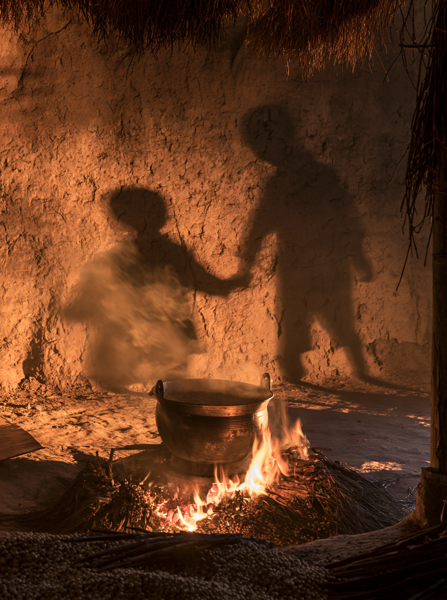
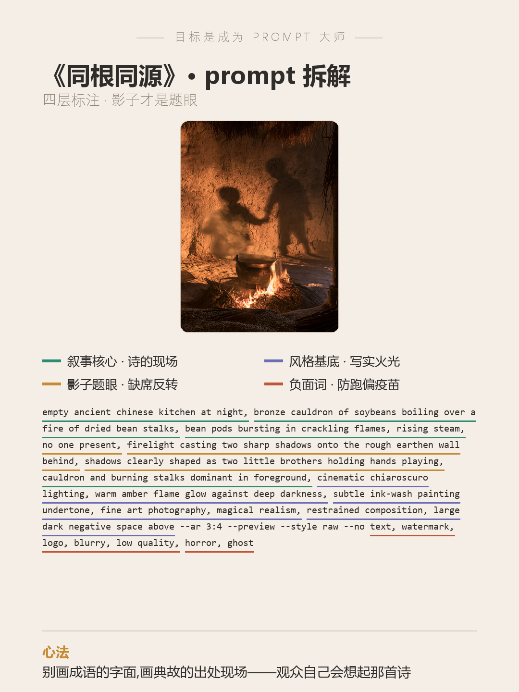

# 目标是成为 Prompt 大师 · 第 10 期《同根同源》

> 封版:v1.0 · 2026-07-17
> 这是一篇可以单独阅读的笔记,不需要任何前置知识。看不懂的词,文末有「名词小抄」。

---

## 先说背景:这是个什么比赛

prompt battle 是一种「同题作画」比赛:主办方出一个主题词,所有人用同一类 AI 画图工具(这次用的是 Midjourney,圈里简称 MJ),比谁的图把主题表达得更准、更巧。这一期是**闪电战**——出题到交图只有很短的时间,观众也是划一眼就投票。

这一期的主题是——**同根同源**。

难点在哪?看到"根"字,几乎所有人的第一反应都是:两棵树,地下根系缠在一起。这个画面不是不对,是**太多人会画**——圈里管这个叫**撞车**。撞车的图再精致,也只是"画得更好的同一张图"。



---

## 一、破题:成语是有出处的

我们先按常规思路发散了一轮:异树同根、天上闪电和地下根系镜像、血管连成根、灯笼汇成火源……全是"根"的变体,都没跳出字面。

真正的转机是一个联想:**同根同源这四个字,中国人都背过它的出处**——

> 煮豆燃豆萁,豆在釜中泣。
> 本是同根生,相煎何太急。

这就是破题的钥匙:**别画成语的字面,画典故的出处现场。**

于是画面变成了《七步诗》的现场:

- **明层(相煎)**:古代灶间,铜锅里豆子在煮,锅底下烧的正是豆萁——诗的字面现场;
- **暗层(同根)**:火光把影子投在土墙上,影子却是**两个孩子牵着手**;
- **余味**:屋里没有人。人早就反目离场了,只有火还在烧,只有影子还记得同根。

**一句话总结**:整张图里没有出现一个"根"字,但看懂的人,自己会把那首诗背出来。你不用解释主题——观众脑子里**预装**了谜底,你只需要触发它。

---

## 二、完整 prompt(可以直接抄)

```
empty ancient chinese kitchen at night, bronze cauldron of soybeans boiling over a fire of dried bean stalks, bean pods bursting in crackling flames, rising steam, no one present, firelight casting two sharp shadows onto the rough earthen wall behind, shadows clearly shaped as two little brothers holding hands playing, cauldron and burning stalks dominant in foreground, cinematic chiaroscuro lighting, warm amber flame glow against deep darkness, subtle ink-wash painting undertone, fine art photography, magical realism, restrained composition, large dark negative space above --ar 3:4 --preview --style raw --no text, watermark, logo, blurry, low quality, horror, ghost
```

> `--no` 是 MJ 的参数,意思是「不要出现以下东西」。`--preview` 是 MJ v8.2 预览版的入口,写实质感比之前的版本又好了一截。

---

## 三、prompt 的四层拆解(重点)

一条好 prompt 不是一堆词随便堆,它分成几个「层」,各管各的事:



- **第 1 层 · 叙事核心(诗的现场)**:空灶间、铜锅煮豆、豆萁当柴火、豆荚在火里爆开。注意**道具就是识别码**——锅、豆、豆萁必须在前景清清楚楚,观众是靠"放大看烧的是什么"接通那首诗的,道具糊了,典故就断了。
- **第 2 层 · 影子题眼(缺席反转)**:这层是整张图的胜负手。三句话锁死:`no one present`(屋里没人)、`firelight casting two sharp shadows`(火光投影)、`shadows clearly shaped as two little brothers holding hands`(影子必须清楚地是两个牵手的孩子)。影子是题眼时,**宁可写直白,不能留模糊**。
- **第 3 层 · 风格基底(写实火光)**:明暗对照的硬光、暖琥珀火光、一点水墨底色、写实摄影质感。写实不是审美偏好,是**影子戏的地基**——影子要可信,得先有真实的光和真实的墙。
- **第 4 层 · 负面词(防跑偏疫苗)**:`--no horror, ghost` 是提前打的疫苗——"空屋 + 影子"这个组合,AI 一不小心就画成恐怖片。负面词不是固定模板,是**你预判到的坑的清单**。

---

## 四、AI 跑偏了,但跑对了(最值钱的经验)

prompt 写的是 `two little brothers`(两个小孩),出图却是**一大一小**两个身影——结果观众一眼读成"哥哥和弟弟",比原设定更贴那首诗。

还有一处没人指挥的细节:锅里的蒸汽升起来,恰好**穿过左边那个影子**,半边身影像被蒸散了——"相煎"正在把那段童年蒸发掉。

**新手最该记住的一条**:AI 跑偏不一定是错误。先看它跑出来的东西是不是**更贴主题**——是,就保留提交,别急着改回去;但也别试图把这种"神来之笔"写回 prompt 里复现,通常会越改越差。

**另一条诚实的经验(含蓄税)**:这张图发出去,不少人的第一反应是"没看懂",直到有人点破"烧的是豆萁、影子是兄弟",评论区才反应过来。**含蓄是要交税的**——在划一眼就投票的比赛里,先被看懂的图永远占便宜;含蓄的图更适合小红书这种愿意停下来细看的地方。如果参赛,最好**备两张**:一张 0.5 秒能看懂的直给版,一张这种埋了典故的深版。

---

## 五、这套思路,你可以怎么套用

下次遇到**成语 / 诗句类主题**(比如「破釜沉舟」「卧薪尝胆」),照这五步走:

1. 先问:这个词**最大路货**的画法是什么?——然后躲开它。
2. 想它的**出处**:这个成语来自哪个故事、哪首诗、哪个现场?
3. 把**出处现场**画出来,把关键道具放在前景当"识别码"。
4. 想一层**反转**:出处现场里,有没有什么可以"缺席"、可以交给影子 / 倒影去说的?
5. 提前打**负面词疫苗**:预判这个画面容易滑向哪里(恐怖?杂乱?),先用 `--no` 拦住。

**成语 → 出处现场的小词库**:

| 成语 | 别画的字面 | 可以画的出处现场 |
|---|---|---|
| 同根同源 | 树根缠绕 | 七步诗:釜中煮豆,豆萁在烧,墙上影子牵手 |
| 破釜沉舟 | 一口破锅 | 渡口:凿沉的船、砸破的锅、只带三日粮的军队 |
| 卧薪尝胆 | 一个苦瓜脸 | 柴堆上的床、房梁上悬着的那颗胆 |
| 刻舟求剑 | "刻舟求剑"四个字 | 船舷上的刻痕,和水底越漂越远的剑 |
| 望梅止渴 | 一颗梅子 | 干裂的行军队伍上空,浮着一片想象的梅林 |
| 铁杵磨针 | 一根针 | 溪边石上磨铁杵的老妇,旁边站着停下脚步的孩子 |

---

## 名词小抄(看不懂的时候查这里)

- **prompt(提示词)**:你写给 AI 的画面描述,AI 照着它画。
- **Midjourney / MJ**:一款主流的 AI 画图工具。
- **`--no`**:MJ 的参数,后面跟「不想让画面出现的东西」。
- **`--preview`**:调用 MJ v8.2 预览版的参数,写实质感更强。
- **`--style raw`**:让 MJ 少做自动美化,保留更真实的质感。
- **撞车**:大家的图思路雷同、长得像,不出彩。
- **闪电战**:限时极短的 prompt battle,观众划一眼就投票。
- **chiaroscuro(明暗对照)**:伦勃朗油画那种一束硬光、大片阴影的打光方式。
- **magical realism(魔幻现实主义)**:画面整体真实,但藏着一件不合常理的事(比如影子和本体不一样)。
- **负空间(negative space)**:画面里刻意留出的大片"空",让主体更突出。
