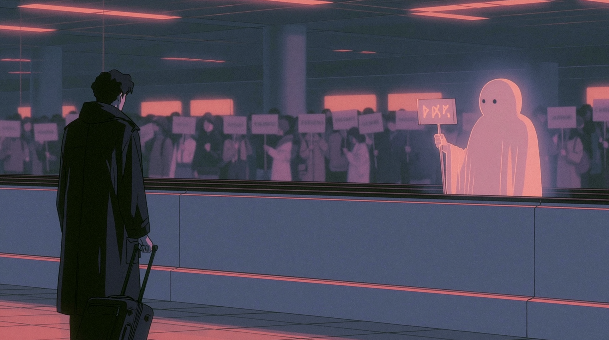
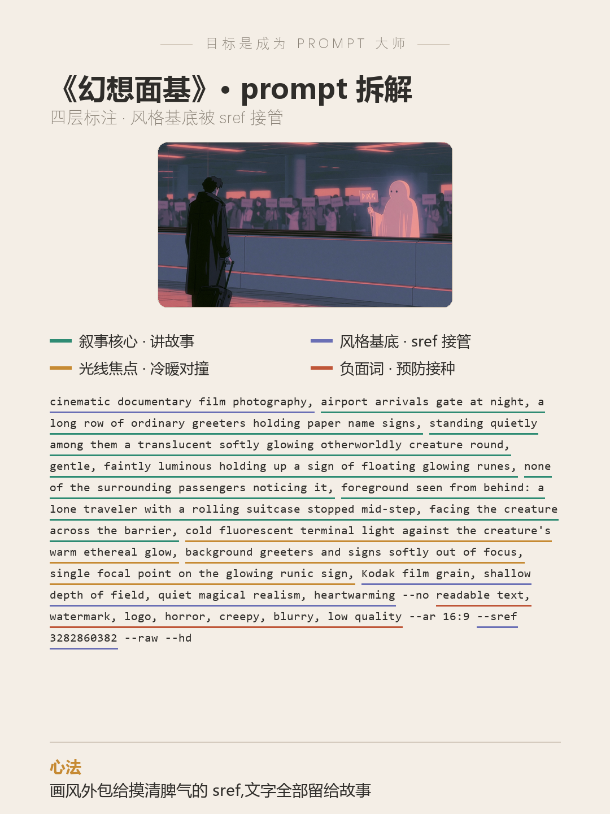

# 目标是成为 Prompt 大师 · 第 11 期《幻想面基》

> 封版:v1.1 · 2026-07-24
> 这是一篇可以单独阅读的笔记,不需要任何前置知识。看不懂的词,文末有「名词小抄」。

---

## 先说背景:这是个什么比赛

prompt battle 是一种「同题作画」比赛:主办方出一个主题词,所有人用同一类 AI 画图工具(这次用的是 Midjourney,圈里简称 MJ),比谁的图把主题表达得更准、更巧。

这一期的主题是——**幻想面基**。

「面基」是网络用语:网上认识的朋友,第一次线下见面。再加上「幻想」二字,大多数人的第一反应大概是:二次元角色走进现实、和游戏里的伙伴拥抱合影——直接画"幻想角色出现在我面前"的大合影。想到一块去了,就是圈里说的**撞车**。

先看图——深夜的机场到达口,一排接机的人举着写名字的纸牌。队伍里安安静静站着一位不属于这个世界的来客:半透明、圆滚滚、微微发光,也举着一块牌子,上面是漂浮的发光符文。周围没有任何人注意到它。只有前景那个拖着行李箱的旅人,在半步之间停住了,隔着栏杆和它对视。



另一个有趣的地方藏在 prompt 里:**这条 prompt 从头到尾写的是"纪实摄影"、"胶片颗粒",出来的却是一张 90 年代怀旧动画的"电影剧照"。**

写照片,出动画,这是翻车吗?不是——这是这一期最值钱的两条经验之一。

---

## 一、破题:面基不画拥抱,画认出的前一秒

「幻想面基」四个字,这张图是这样翻译的:

1. **「面基」→ 它的标准仪式现场**:机场接机举牌。"接机"自带完整剧情——网上认识、第一次线下见、举着牌子等对方认出自己。人人秒懂,一个字的解释都不用。
2. **「幻想」→ 落在对方身上,而不是场景上**:来接你的网友,是一只发光的异界生物。它不捣乱、不吓人,就像普通接机人一样安静排队、举牌——幻想浓度全部集中在这一个主体上,场景保持百分百日常。
3. **符文牌 = 你的网名**:接机牌上的名字,本来就只有被接的人认识——对路人来说,那就是一串"乱码"。把它画成发光的符文,这层意思一下子就有了画面。
4. **让所有人都不看它**:`none of the surrounding passengers noticing it`(周围没有一个人注意到它)——这句正是面基的情感内核:**你的网友对全世界是陌生人,对你是人群里唯一发光的存在。**
5. **不画见面拥抱,画认出的前一秒**:前景的旅人半步刹住(`stopped mid-step`)。整场面基被压缩在"认出的瞬间"——最有张力的不是拥抱,是那半步。

**一句话总结**:抽象的社交词,先找到它的**标准仪式现场**;超现实的东西想可信,就让它**安安静静排进日常的队伍里,然后没有人多看它一眼**。

---

## 二、完整 prompt(可以直接抄)

```
cinematic documentary film photography, airport arrivals gate at night, a long row of ordinary greeters holding paper name signs, standing quietly among them a translucent softly glowing otherworldly creature round, gentle, faintly luminous holding up a sign of floating glowing runes, none of the surrounding passengers noticing it, foreground seen from behind: a lone traveler with a rolling suitcase stopped mid-step, facing the creature across the barrier, cold fluorescent terminal light against the creature's warm ethereal glow, background greeters and signs softly out of focus, single focal point on the glowing runic sign, Kodak film grain, shallow depth of field, quiet magical realism, heartwarming --no readable text, watermark, logo, horror, creepy, blurry, low quality --ar 16:9 --sref 3282860382 --raw --hd
```

> `--no` 是 MJ 的参数,意思是「不要出现以下东西」;`--sref` 后面跟一个编号,意思是「照这个编号对应的风格来画」。

---

## 三、prompt 的四层拆解(重点)

一条好 prompt 不是一堆词随便堆,它分成几个「层」,各管各的事:



- **第 1 层 · 叙事核心层(讲故事)**:深夜到达口、举牌的接机人、队伍里的发光来客、没人注意它、半步停住的旅人。整条 prompt 八成的字数都花在这里。
- **第 2 层 · 风格基底层(决定画风)**:`cinematic documentary film photography` + `Kodak film grain`——但注意,**这一层实际被 `--sref 3282860382` 接管了**(下一节细讲)。
- **第 3 层 · 光线焦点层(告诉观众看哪里)**:冷荧光的航站楼 × 生物身上唯一的暖光,再加"背景全部虚化、焦点只给符文牌"。整张图的视线被这两句话钉死。
- **第 4 层 · 负面词(提前打疫苗)**:`--no readable text, horror, creepy...`——为什么要提前写?见第五节。

---

## 四、最值钱的经验:画风,可以整个"外包"给一个编号

`--sref` 是 MJ 的"风格参考"参数:给它一个编号,MJ 就会按那个编号背后的风格来画。

这一期发生的事情是:**prompt 明明写了"纪实摄影、胶片颗粒",出图却是 90 年代赛璐璐动画**——因为一个"性格强势"的 sref,会直接覆盖你文字里的画风词。

听起来像事故,其实是**分工**:

| 谁 | 管什么 |
|---|---|
| `--sref 3282860382` | 画风:90 年代怀旧动画的颜色、质感、气氛 |
| 文字里的摄影词 | 语法:浅景深、单一焦点、抓拍构图、克制的光比 |
| 其余全部文字 | 故事:谁、在哪、发生了什么 |

摄影词没有白写——它虽然管不了"画成照片还是动画",但它把**镜头感**带进了动画渲染里,所以出来的是"动画电影的剧照",而不是一张普通插画。

**新手最该记住的一条**:与其花二十个词描述你想要的画风(还不一定灵),不如**找到一个你喜欢的 sref 编号,把画风整个交给它,文字全部省下来讲故事**。

两个提醒:

- sref 就像盲盒,每个编号脾气不同。**先拿它试几张小图,摸清脾气再上场**,别在正式作品里第一次开盒。
- 如果你的题材必须是"真实照片质感",就别挂强势的画风 sref——它会赢的。

---

## 五、负面词的进阶用法:不等翻车,提前打疫苗

负面词(`--no` 后面那串)的常规用法是"上一版画错了什么,就把它加进去"。这一期用的是进阶版:**出第一版之前,先预判 AI 最可能画错什么,提前写进去**。

写完 prompt 后问自己一句:"AI 拿到这段话,最可能画错什么?"

这一期的预判(都是 AI 的高频翻车方向):

| 预判 | 疫苗 |
|---|---|
| 一排"名牌"必出乱码假文字 | `--no readable text`(顺便让符文牌更干净) |
| "深夜+半透明发光生物"容易画成恐怖片 | `--no horror, creepy` |

这两针都是在第一版之前打的。**负面词不只是踩坑记录,还可以是"预防针"。**

---

## 六、这套思路,你可以怎么套用

下次遇到**社交关系类的抽象题**(面基 / 告白 / 重逢 / 告别),照这五步走:

1. 先找这段关系的**标准仪式现场**(面基→接机举牌 / 告别→站台送车 / 重逢→巷口撞见)——仪式自带剧情,人人秒懂。
2. 把题目里的"幻想/超现实"**集中在一个主体上**,让它安静守规矩地参与仪式,场景保持百分百日常。
3. 写上"**周围没有人注意它**"——这句是魔幻现实主义的开关,也常常正是关系的情感内核。
4. 留一个**唯一看见它的人**,给观众一个代入的位置;时间停在**事情发生的前一秒**,别画结果。
5. 画风交给一个**你摸清了脾气的 sref**,文字全部留给故事;发图前把"最可能翻车的方向"提前写进 `--no`。

---

## 名词小抄(看不懂的时候查这里)

- **面基**:网络用语,网上认识的朋友第一次线下见面。
- **prompt(提示词)**:你写给 AI 的画面描述,AI 照着它画。
- **Midjourney / MJ**:一款主流的 AI 画图工具。
- **`--no`**:MJ 的参数,后面跟「不想让画面出现的东西」。
- **`--sref`(风格参考)**:MJ 的参数,后面跟一个编号,让 MJ 照这个编号对应的风格来画。同一个编号,任何人任何时候用,风格都一样,所以圈里会互相分享"好用的编号"。
- **`--ar 16:9`**:画面比例,16:9 就是宽屏。
- **`--raw` / `--hd`**:让 MJ 少加自作主张的美化 / 用更高质量模式。
- **赛璐璐动画**:老式手绘动画的工艺,90 年代日本动画那种平涂上色、干净轮廓线的质感。
- **浅景深**:摄影术语,焦点处清晰、前后景虚化——观众的眼睛会被强制看向清晰的地方。
- **魔幻现实主义**:超现实的事物放在极其日常的场景里,而且所有人都习以为常。
- **撞车**:大家的图思路雷同、长得像,不出彩。
