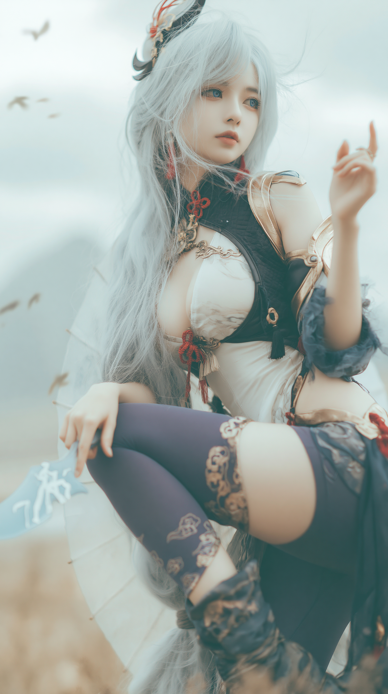
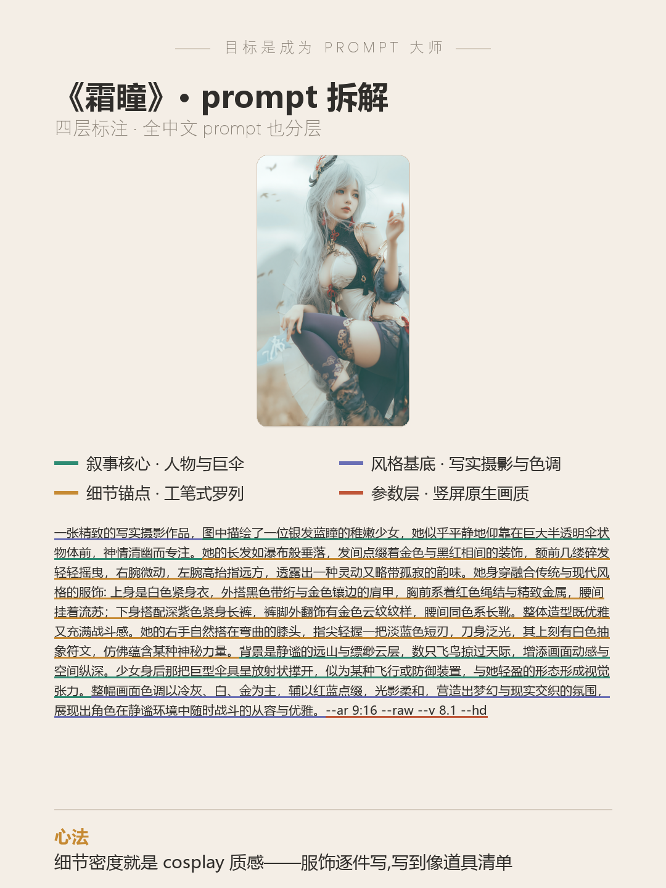

# 目标是成为 Prompt 大师 · 第 12 期《霜瞳》

> 封版:v1.0 · 2026-07-27
> 这是一篇可以单独阅读的笔记,不需要任何前置知识。看不懂的词,文末有「名词小抄」。

---

## 先说背景:这张图不是比赛图

前面几期讲的都是 prompt battle(同题作画比赛)。这一期不一样——它来自**即兴抽卡**:没有题目、没有对手,就是打开 Midjourney(圈里简称 MJ,一款主流 AI 画图工具)自由出图,像抽卡一样看手气,再从一堆图里挑出能立住的那张。

这张《霜瞳》,银发蓝瞳的仙侠 cosplay 写真,后来发到了小红书。发布 6 天:曝光 5400+、点赞 579,并且拿到了**平台官方推广**——对一个几百粉的账号来说,这是这套 prompt 写法值得复盘的最好理由。



---

## 一、这张图靠什么立住

抽卡图想让人停下滑动的手,得有「角色设定感」——看一眼就觉得"这是个有故事的角色",而不是"一张漂亮脸"。这张图的设定感来自三个道具:

1. **巨伞**:少女身后放射状撑开的半透明巨伞,既是构图背景板,又像某种飞行装置,一眼记住;
2. **符文短刃**:指尖轻握的淡蓝色短刃,刀身刻白色符文——「优雅但随时能打」;
3. **银发蓝瞳 + 高调薄雾**:整张图近乎白色的雾感底色,把冷色人设推到极致。

三个道具都不是运气,是 prompt 里**一件一件写出来的**。

---

## 二、完整 prompt(可以直接抄)

```
一张精致的写实摄影作品，图中描绘了一位银发蓝瞳的稚嫩少女，她似乎平静地仰靠在巨大半透明伞状物体前，神情清幽而专注。她的长发如瀑布般垂落，发间点缀着金色与黑红相间的装饰，额前几缕碎发轻轻摇曳，右腕微动，左腕高抬指远方，透露出一种灵动又略带孤寂的韵味。她身穿融合传统与现代风格的服饰:上身是白色紧身衣，外搭黑色带绗与金色镶边的肩甲，胸前系着红色绳结与精致金属，腰间挂着流苏；下身搭配深紫色紧身长裤，裤脚外翻饰有金色云纹纹样，腰间同色系长靴。整体造型既优雅又充满战斗感。她的右手自然搭在弯曲的膝头，指尖轻握一把淡蓝色短刃，刀身泛光，其上刻有白色抽象符文，仿佛蕴含某种神秘力量。背景是静谧的远山与缥缈云层，数只飞鸟掠过天际，增添画面动感与空间纵深。少女身后那把巨型伞具呈放射状撑开，似为某种飞行或防御装置，与她轻盈的形态形成视觉张力。整幅画面色调以冷灰、白、金为主，辅以红蓝点缀，光影柔和，营造出梦幻与现实交织的氛围，展现出角色在静谧环境中随时战斗的从容与优雅。 --ar 9:16 --raw --v 8.1 --hd
```

对,**全中文**。MJ v8.1 直接吃这条中文长 prompt,不需要先翻译成英文。

---

## 三、prompt 的四层拆解(重点)

系列老规矩,把 prompt 切成四层看,各管各的事。这期是人像写真题,四层跟着题型变了变:



- **第 1 层 · 叙事核心层(讲故事)**:谁、什么姿态、背后什么大物件——「银发蓝瞳少女 + 仰靠巨伞 + 神情清幽」加上结尾的「远山云层飞鸟」。人设和空间,一头一尾各一句。
- **第 2 层 · 风格基底层(决定画风)**:开头一句「精致的写实摄影作品」定性,结尾一句「色调以冷灰、白、金为主,辅以红蓝点缀」收束。**开头管质感,结尾管配色**,首尾呼应把全图罩住。
- **第 3 层 · 细节锚点层(这期的胜负手)**:中间那一大段服饰道具的**工笔式罗列**——紧身衣、肩甲、绳结、流苏、长裤、云纹、长靴、短刃、符文,一件一件写,写到像道具清单。cosplay 的"质感"就是从这个密度里来的:AI 每多拿到一件明确的道具,画面就少一分含糊。
- **第 4 层 · 参数层**:`--ar 9:16` 竖屏原生出图、`--raw` 少加戏、`--v 8.1` 指定版本、`--hd` 高清。这期没有 `--no`——写实摄影 + 细节写满时,AI 没什么空间乱画,负面词可以省。

---

## 四、三条值钱的经验

**1. 中文长 prompt,直接喂。**
很多教程说 prompt 必须英文,这张图证明 v8.1 时代不用了:中文散文式描述,人物、服饰、氛围全部命中。中文最大的好处是**你能写得更细**——「黑色带绗与金色镶边的肩甲」这种句子,翻成英文反而容易丢细节。

**2. 细节密度就是 cosplay 质感。**
写「一个仙侠少女」出来的是路人;写满九件套装备出来的才是「有设定的角色」。想要 cos 感、游戏立绘感,就把服饰当道具清单一件件报。

**3. 竖屏参数是发布侧的先手棋。**
`--ar 9:16` 出图即竖屏,发小红书 / 快手 / 抖音不用裁,人物顶天立地占满屏——这半个参数,省掉后期一整步。

---

## 五、发布侧的两个小心得(图好只是一半)

这张图的成绩有一半在发布动作上,也照实记下:

1. **投对流量池**:它没有和古风、暗黑系图混发,而是单独主投**二次元 / cosplay 垂类**——受众预装了「游戏角色」的审美语境,识别成本最低。
2. **选帧选「道具信息最全」的一帧**:同组图里,最终封面选了「纸伞 + 符文刃 + 抬手」都入镜的这张,而不是脸最好看的那张——缩略图阶段,**信息量比颜值更能让人点进来**。

---

## 六、这套思路,你可以怎么套用

下次想出一张「有设定感」的角色写真,照这个六段结构写中文 prompt:

1. **定性句**:一张精致的写实摄影作品 / 电影感人像……(管质感)
2. **人物内核**:发色 + 瞳色 + 年龄气质 + 神情(一句立人设)
3. **姿态**:手在哪、身体靠着什么(动作越具体越不呆板)
4. **服饰道具罗列**:上身、外搭、配饰、下身、鞋,一件一件报,每件带材质或颜色
5. **点睛道具 + 大物件**:一小(手里的短刃)一大(身后的巨伞),小的给性格,大的给构图
6. **背景与色调收束**:远景一句 + 「整幅画面色调以 X、Y 为主,辅以 Z 点缀」

---

## 名词小抄(看不懂的时候查这里)

- **prompt(提示词)**:你写给 AI 的画面描述,AI 照着它画。
- **Midjourney / MJ**:一款主流的 AI 画图工具。
- **即兴抽卡**:不带题目自由出图,从大量结果里挑图,像抽卡看手气。
- **prompt battle**:同题作画比赛,前几期讲的都是它。
- **`--ar 9:16`**:出图宽高比参数,9:16 就是手机竖屏比例。
- **`--raw`**:让 MJ 少做自作主张的美化,更贴 prompt 原文。
- **`--hd`**:高清模式,细节更扎实。
- **高调(high-key)**:整体偏亮、接近白色的影调,雾蒙蒙的干净感。
- **垂类流量池**:平台按兴趣分的推荐圈子,比如二次元圈、古风圈;投对圈子,推荐更准。
- **官方推广**:平台把内容主动推给更多人的加权流量。
