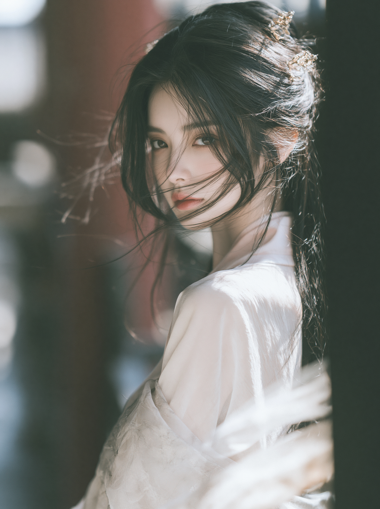
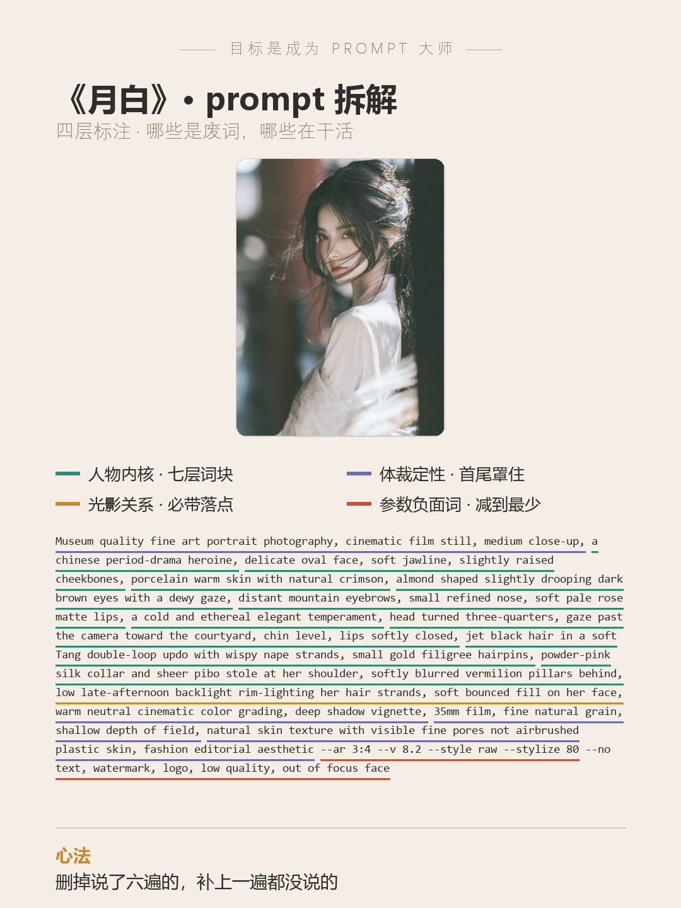

# 目标是成为 Prompt 大师 · 第 13 期《月白》

> 封版：v1.0 · 2026-08-18
> 这是一篇可以单独阅读的笔记，不需要任何前置知识。看不懂的词，文末有「名词小抄」。

---

## 先说背景：这一期不是「写」，是「改」

前 12 期讲的都是从零写一条 prompt（提示词，就是你写给 AI 的画面描述）。这一期反过来——**手上已经有一条 prompt，但出图不对，怎么改。**

这其实是大多数人的真实处境：网上抄一条、群里要一条、自己拼一条，跑出来总差一口气，却不知道该动哪个词。

本期的原始 prompt 就是一条典型的「网上流传款」：很长、很满、看起来很专业，但一跑就垮。

我们把它逐条改了一遍，出的就是这张。



---

## 一、原始 prompt 长什么样

先看病人：

```
Beautiful Chinese historical drama heroine, full body, tall slender figure,
wearing a soft pink ancient Tang royal dress, long flowing skirt, golden waist belt,
delicate earrings and hair ornaments, elegant calm expression,
standing in an old Thai palace courtyard, silk fabric moving gently in the wind.
Cinematic romance film lighting, realistic Asian beauty, detailed face, natural skin,
graceful posture, luxury costume design. Hyper realistic portrait photography,
straight out of camera aesthetic, smooth natural skin with subtle sheen and visible pores,
naturally rosy lips, crisp hair details, soft unforced expression.
Ultra high definition, precise skin texture, natural lighting, cinematic quality,
shallow depth of field, soft balanced light and shadow, full length portrait
--no excessive smoothing, plastic skin, AI generated face, distorted features,
blurry eyes, overexposure, noise, cropped feet, extra fingers
```

一百三十多个词，看着挺唬人。问题也正好藏在「看着挺唬人」里。

---

## 二、五个病灶

### 病灶 1 · 两个锚打架：唐朝的衣服，泰国的院子

`ancient Tang royal dress`（唐朝宫廷服）＋ `old Thai palace courtyard`（古泰国宫廷庭院）。

AI 拿到 "Thai palace" 会画金色尖顶、那伽栏杆、东南亚寺庙屋脊，唐制襦裙套进去就成了「东南亚宫廷剧」，开头那句 `Chinese historical drama heroine`（中国古装剧女主角）直接作废。

**一张图只能有一个文化锚。** 两个锚同时写，AI 不会取舍，只会把它们搅在一起。

### 病灶 2 · 形容词不是 prompt

`Beautiful`（漂亮）、`realistic Asian beauty`（真实的亚洲美人）、`detailed face`（精致的脸）。

这三个词加起来的信息量是零。AI 不知道「漂亮」长什么样——它只知道具体的骨相、眼型、唇色、肤质。

**"漂亮"不是关键词，"杏眼、略下垂、深棕瞳"才是。**

### 病灶 3 · 同一件事说了六遍

数一下这条 prompt 里表达「画质好」的词：`Hyper realistic` / `Ultra high definition` / `precise skin texture` / `cinematic quality` / `natural skin` / `smooth natural skin with subtle sheen and visible pores`。

六个词，一个意思。

AI 的注意力是有限的，prompt 越长，每个词分到的注意力越少。**重复描述不会让效果加倍，只会把真正重要的词挤下去。**

### 病灶 4 · 光写成了「天气」，不是「关系」

`Cinematic romance film lighting`（电影浪漫片打光）、`natural lighting`（自然光）、`soft balanced light and shadow`（柔和均衡的光影）。

这三句都是**氛围词**，说了等于没说——AI 不知道光从哪来、打在哪儿。这类词在后面的胶片质感词一压，基本会被抹平。

**光要写关系和落点**：光从哪个方向来、扫在身体的哪个部位。

### 病灶 5 · 负面词不是免费的

`--no` 是 Midjourney（AI 画图工具，圈里简称 MJ）的排除参数，写在后面的东西 AI 会尽量不画。

原始 prompt 的 `--no` 里塞了：`plastic skin`（塑料皮肤）、`AI generated face`（AI 脸）、`distorted features`（畸形五官）、`blurry eyes`（模糊的眼睛）、`extra fingers`（多余手指）。

这里有个反直觉的坑：**`--no` 后面的词，审核系统照样当普通词读进去。**

也就是说，一条已经写满「真实、人像、皮肤」的 prompt，你再在 `--no` 里补一串 `skin / face / eyes / fingers`，等于往同一个方向又添了一把火——排除效果没拿到，却把整条 prompt 推得更靠近审核线，容易直接被拦下来不给出图。

安全的 `--no` 只留纯画质项：`text, watermark, logo, low quality`。

### 附带一条：一个参数都没写

原始 prompt 结尾没有 `--v`（版本）、没有 `--ar`（画幅比例）、没有 `--style raw`。

不写版本就跑默认模型，不写比例就出正方形。**写实人像出正方形，等于白跑。**

---

## 三、改完的完整 prompt（可以直接抄）

```
Museum quality fine art portrait photography, cinematic film still, medium close-up,
a chinese period-drama heroine, delicate oval face, soft jawline, slightly raised cheekbones,
porcelain warm skin with natural crimson, almond shaped slightly drooping dark brown eyes
with a dewy gaze, distant mountain eyebrows, small refined nose, soft pale rose matte lips,
a cold and ethereal elegant temperament,
head turned three-quarters, gaze past the camera toward the courtyard, chin level,
lips softly closed, jet black hair in a soft Tang double-loop updo with wispy nape strands,
small gold filigree hairpins,
powder-pink silk collar and sheer pibo stole at her shoulder,
softly blurred vermilion pillars behind,
low late-afternoon backlight rim-lighting her hair strands, soft bounced fill on her face,
warm neutral cinematic color grading, deep shadow vignette, 35mm film, fine natural grain,
shallow depth of field, natural skin texture with visible fine pores not airbrushed plastic skin,
fashion editorial aesthetic
--ar 3:4 --v 8.2 --style raw --stylize 80 --no text, watermark, logo, low quality, out of focus face
```

比原来还短一点，但每个词都在干活。

---

## 四、prompt 的四层拆解

系列老规矩，把 prompt 切成四层看，各管各的事。这期是人像改写题，四层跟着题型变了变：



- **第 1 层 · 人物内核层（这期的胜负手）**：从 `delicate oval face` 到 `a cold and ethereal elegant temperament` 那一整段。脸型、肤质、眼型、眉、鼻、唇、气质，**七个槽位一个不落**。原始 prompt 那三个「漂亮」全部换成了这一段。其中**眼睛和气质是灵魂**——`almond shaped slightly drooping`（杏眼略下垂）决定勾不勾人，`cold and ethereal`（清冷空灵）决定整张脸的温度。

- **第 2 层 · 体裁定性层**：开头 `Museum quality fine art portrait photography, cinematic film still`（博物馆级艺术人像摄影 · 电影剧照），结尾 `fashion editorial aesthetic`（时尚杂志摄影）。**开头管质感，结尾管体裁，首尾把整张图罩住。** 顺带一提，这套词还有个隐藏作用：它把画面归类到「艺术摄影」而不是「真人照片」，过审率会明显好看。

- **第 3 层 · 光影关系层**：`low late-afternoon backlight rim-lighting her hair strands, soft bounced fill on her face`——低角度的午后逆光，勾在发丝上；脸上补一层柔和的反射光。

  对照图看：她发丝那圈银亮的边，就是这一句画出来的。原始 prompt 的 `natural lighting` 永远画不出这个。**关系词 + 落点，是打光唯一有效的写法。**

- **第 4 层 · 参数与负面词层**：`--ar 3:4` 竖版、`--v 8.2` 指定版本、`--style raw` 少加戏、`--stylize 80` 压风格化强度、`--no` 只留四个纯画质词 + 一个 `out of focus face`（保护主体清晰）。

---

## 五、三条值钱的经验

**1. 写实人像，先建一段「五官词块」，再谈别的。**

脸型 → 肤质 → 眼 → 眉 → 鼻 → 唇 → 气质，七个槽位。写好一次，以后所有人像题都能复用，换气质就换一个词：

| 想要的味道 | 气质层写法 |
|---|---|
| 清冷、有距离 | `cold and ethereal elegant temperament` |
| 妩媚、成熟 | `sultry and alluring sensual temperament` |
| 温柔、亲和 | `gentle warm approachable temperament` |
| 慵懒、疏离 | `languid detached melancholic temperament` |

一个词换掉，整张脸的温度就变了，其余六层一个字不用动。

**2. 想要光影，写「关系 + 落点」，别写天气。**

`golden hour`（黄金时刻）、`sunny`（阳光明媚）、`natural lighting`（自然光）——这些都是氛围参考，不是打光指令，遇到胶片色卡就被压平。

改成 `backlight rim-lighting her hair strands`（逆光勾发丝）、`hard window light slicing across her face`（硬窗光斜切过脸）这种带方向、带落点的句子，才真的生效。

**3. 版本号不能只改数字。**

这条跑在 MJ v8.2 上。v8.2 官方的取向明确偏「大胆、抢眼、强对比」——这对浓烈题材是顺风，对**淡雅、克制、低饱和**的题材是逆风。

所以只把 `--v 8.1` 改成 `--v 8.2` 是不够的，**必须同时把 `--stylize` 往下压**（默认 100，这条压到 80）。不压，出来会又浓又艳，把「清冷」冲掉。

---

## 六、诚实记一笔：五张脸不是同一个人

这一批一共出了五张。放在一起看气质很统一——月白纱衣、金细簪、朱红柱、逆光——但**仔细看，五张的脸并不是同一个人**：有的偏圆脸少女感，有的偏长脸成熟，有的骨相更浓。

这是正常的。这条 prompt 做的是「气质锚定」，不是「角色锁定」。想让五张图是同一个人，得另外上锁脸的手段，那是另一套活。

所以这组图的正确用法是**当一组氛围图发**，而不是当「一个角色的组图」发。分清这两件事，能省掉很多返工。

---

## 七、这套思路，你可以怎么套用

下次手上有一条跑不对的 prompt，按这个顺序体检：

1. **查冲突**：有没有两个打架的锚？（朝代 × 地域、季节 × 光线、年龄 × 气质）
2. **删形容词**：把 `beautiful / stunning / detailed / amazing` 全划掉，看还剩什么
3. **数重复**：同一个意思说了几遍？每个意思只留最准的那一个
4. **补具体**：划掉的形容词，一个一个翻译成可以被相机拍到的东西
5. **改打光**：把天气词换成「光从哪来 + 打在哪儿」
6. **清 `--no`**：只留 `text, watermark, logo, low quality`，人体和脸相关的词全部拿掉
7. **补参数**：`--ar` 比例、`--v` 版本、`--style raw`，一个都不能少

七步走完，通常比重写一条还快。

---

## 名词小抄（看不懂的时候查这里）

- **prompt（提示词）**：你写给 AI 的画面描述，AI 照着它画。
- **Midjourney / MJ**：一款主流的 AI 画图工具。
- **`--no`**：排除参数，写在它后面的东西 AI 会尽量不画。注意它**不是免费的**，见病灶 5。
- **`--ar`**：画幅比例参数，`--ar 3:4` 就是竖版。
- **`--v 8.2`**：指定用哪个版本的模型。
- **`--style raw`**：让 MJ 少做自作主张的美化，更贴 prompt 原文。
- **`--stylize`**：风格化强度，数字越大 AI 自己加的戏越多，默认 100。
- **逆光（backlight）**：光源在人物背后，会在头发和肩膀边缘勾出一圈亮边。
- **rim light（轮廓光）**：就是上面说的那圈亮边。
- **反射光 / 补光（bounced fill）**：从亮处弹回来的柔光，用来把暗部提亮一点，不至于死黑。
- **色调（color grading）**：整张图的统一色彩倾向，比如「暖中性调」。
- **暗角（vignette）**：画面四角压暗，把视线收回中间。
- **披帛（pibo）**：唐代女子搭在双臂上的一条长纱，走动时会飘起来。
- **景深（depth of field）**：焦点清楚、前后模糊的程度；浅景深＝背景糊成一片。
